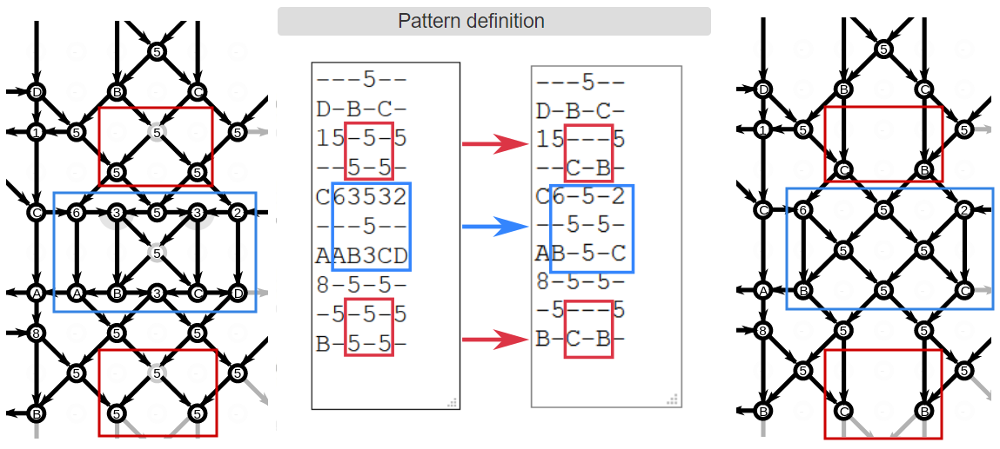

Demo with a Binche ground
=========================
 
A Paris ground as ring pairs around snowflakes becomes particularly challenging to work when using a combination of half-stitch (CT) and whole-stitch (CTCT) in the ring pairs.
To better understand this ground, a GroundForge model was made.

_Figure 1: Paris ground and snowflake rings worked with whole (CTCT, red) and half (CT, green) stitch_

Since this lace ground has been captured in GroundForge, it is relatively straight forward to play with stitches as well as different snowflake variations. 
We invite you to experiment using the GroundForge base pattern [with] or [without] foot sides.  
Click on a stitch in the pair diagram to apply the stitch specified in the text field just above the diagram.
This text field can have any combination of 'c', 't', 'r' or 'l'. You can try just a '-' to drop a stitch
but this can have unexpected results, you may be better off with the [advanced pattern editing](#advanced-pattern-editing).
Just below the banner of the _stitches and threads_ page you can unfold help links for more detailed instructions.

Below are four main variations showing the pair diagram coded with [4 colors] per stitch (top row) and the corresponding thread diagram (bottom row).

[4 colors]: /GroundForge-help/color-rules

_Figure 2: Four variations of Binche Kompakt 31 alias TT4 alias B4.2_

The extensive catalogue _Viele gute Gründe_ by Ulricke Voelcker-Löhr contains many snowflake variations in the B3 series.  Several of these are similar to one of the four variations presented here:
* In 7 snowflakes (25, 71-76), two diagonal pairs cross twice, as in the first variation above.
* In 28 snowflakes (5, 6, 17-23, 26-36, 93, 103, 132, 139, 140), diagonal pairs cross just once as in the second variation above.
* There are 3 variations (106-108) that do not enclose the top and bottom pin like the third variation,
* and 3 with a hole in the middle of the snowflake (12-14) like the fourth variation. 
 
 This gives 41 snowflake-variations that can be easily modeled in GroundForge. We can multiply this by the 22 variations of B4 (stitch variations for ring pairs that surround a six-pair element) to give 902 stitch-variations of the basic pattern documented in VGG.  Using slightly unorthodox methods, such as twisting only the left or only the right pair (only B3.33 and B3.106 of VGG use these kinds of stitches) or allowing more than three cross/twist combinations at each intersection, results in thousands of variations.

[without]: /GroundForge/stitches?patchWidth=19&patchHeight=22&d1=ctct&e2=ct&c2=ct&a2=lct&f3=ctct&d3=ctc&b3=ctct&a3=ct&e4=ctc&c4=ctc&f5=ctc&e5=ctc&d5=ctc&c5=ctc&b5=ctc&a5=ct&d6=ctc&f7=ctc&e7=ctc&d7=ctc&c7=ctc&b7=ctc&a7=rct&e8=ctc&c8=ctc&a8=ct&f9=lctct&d9=ctc&b9=rctct&e10=lct&c10=rct&a10=ct&tile=---5--,D-B-C-,15-5-5,--5-5-,C63532,---5--,AAB3CD,8-5-5-,-5-5-5,B-5-5-&footsideStitch=ctctt&tileStitch=ctc&headsideStitch=ctctt&shiftColsSW=0&shiftRowsSW=10&shiftColsSE=6&shiftRowsSE=5
[with]: /GroundForge/stitches?patchWidth=19&patchHeight=21&y1=ctcttr&g1=ctct&a1=ctcttl&x2=ctc&w2=ctc&h2=ct&f2=ct&d2=ct&c2=ctc&b2=ctc&x3=ctcrr&w3=ctc&i3=ctct&g3=ctc&e3=ctct&d3=ct&c3=ctc&b3=ctcll&y4=ctcttr&x4=ctc&w4=ctc&h4=ctc&f4=ctc&c4=ctc&b4=ctc&a4=ctcttl&i5=ctc&h5=ctc&g5=ctc&f5=ctc&e5=ctc&d5=ct&g6=ctc&y7=ctcttr&x7=ctcrr&w7=ctc&i7=ctcr&h7=ctc&g7=ctc&f7=ctc&e7=ctcl&d7=ct&c7=ctc&b7=ctcll&a7=ctcttl&x8=ctc&w8=ctc&h8=ctcr&f8=ctcl&d8=ct&c8=ctc&b8=ctc&i9=ctct&g9=ctct&e9=ctct&x10=ctcrr&w10=ctc&h10=ct&f10=ct&d10=ct&c10=ctc&b10=ctcll&footside=B--,XCD,-11,B88,XXX,---,AAA,X78,X--,-AA&tile=---5--,D-B-C-,15-5-5,--5-5-,C63532,---5--,AAB3CD,8-5-5-,-5-5-5,B-5-5-&headside=--C,ABX,88-,11C,XXX,---,DDD,14X,--X,DD-&footsideStitch=ctct&tileStitch=ctc&headsideStitch=ctct&shiftColsSW=0&shiftRowsSW=10&shiftColsSE=6&shiftRowsSE=5

#### Advanced pattern editing

Dropping stitches using '-' can have unexpected results. 
For a safer alternative you can follow the link to the _pattern definition_.
Note that this page has its own (overlapping) set of help links.
Figure 3 shows snippets of that page.
In these snippets, the blue edits remove the middle stitch for variation 2.
The red edits remove the top and bottom stitches for variation 3.
Dropping the middle stitch causes a W shape in figure2, the blue edit gives a more familiar position of the remaining stitches.
For variation 4 you can choose to remove the middle stitch and add twists to the adjacent cloth stitches,
or apply just a twist to the middle stitch.

 

_Figure 3: Edit the pattern definition_

Please note that (except along edges) a grey half circle indicates a problem.
In the example on the right, two pairs are entering but only one pair is leaving the stitch.
When you are done editing the pattern, you can follow the link _stitches and threads_
to return to the pair and thread diagram.

### History of the ground

Before Ulricke Voelcker-Löhr published the ground as B4.2 in _Viele Gute Gründe_ (2002-2005), she had already used the ground in an exercise in _Schneeverweht und Durchgedreht_ published in 1998.  This exercise comes with a close-up photograph on the last page.

In issue 2000/2 of the Belgian lace magazine [_Kant_](https://www.kantcentrum.eu/en/magazine), Anne-Marie Verbeke-Billiet published a handkerchief pattern called _Anneke_ based on an old Valenciennes example.  She included four variations of stitches traditionally used in Paris ground and in the ring pairs around snowflakes.  The variation that is most unusual uses a combination of whole (CTCT) and half (CT) stitches.  This stitch combination, which she labels TT4 in the article, has the effect of blurring the ring pairs around the snowflakes until they almost disappear.  According to Verbeke-Billiet, this stitch combination was once as popular as the whole stitch variation (TT1 in Kant and B4.1 in VGG) that is so familiar today. TT4 fell out of the lacemaker's repertoire around 1900 perhaps because, like many half-stitch grounds, it is very difficult to work. The threads don't travel in tidy vertical and diagonal lines making it hard, especially when worked without pins, to keep track of where you are in the pattern.
 
In 2004, Hildegund Jene published a sampler called _Binche Kompakt_ which featured 32 different grounds drawn from Flemish, Parisian,and Valenciennes laces.  Ground number 31 is the challenging TT4 ground described by Verbeke-Billiet.  When Jo Pol started to work on Binche Kompakt, she had no access to _Schneeverweht_ and could find neither a thread diagram, nor a high resolution photo of a sample of TT4.  She decided to create a thread diagram using GroundForge.  This exercise motivated Pol to include several of the features you find in GroundForge today. 
The sampler is no longer available from the [Deutscher Klöppelverband], but you may find it in the second-hand market.

[Deutscher Klöppelverband]: https://www.deutscher-kloeppelverband.de/

Another sampler suitable to practice variations of the ground is an edging designed by the Tini Bruins,
published in 2018 by the LOKK as _[kantje van de maand]_, also nr 31.

[kantje van de maand]: https://lokknl.org/wp-content/uploads/2025/08/kantje31.pdf