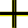

Color Code
==========

- **New [approach](/GroundForge/images/stitches-legens.svg)**
- [Color code dialects](#color-code-dialects)
- [Twist marks by GroundForge](#twist-marks-by-groundforge)
- [Colors by GroundForge](#colors-by-groundforge)
- [Tweak Colors](#tweak-colors)

Click/tap the swatch icon  for
a legend of stitches that are actually used in the pattern.

Color code dialects
-------------------

Various dialects of color codes for pair diagrams are used by bobbin lace designers:
There is at least a [Belgian] version, a simplified [Danish] version and a [red-blue] version and perhaps more.
These dialects can distinguish only about half a dozen of stitches.

The primary pair diagram applies a completely different [approach](/GroundForge/images/stitches-legens.svg)
and can distinguish 147 stitches.
The pair diagrams for the Droste patterns apply dialect of the traditional code,
details in the following sections.

[Belgian]: https://www.mail-archive.com/lace@arachne.com/msg51345.html
[Danish]: https://www.mail-archive.com/lace@arachne.com/msg51355.html
[red-blue]: https://susanroberts.info/wp-content/uploads/2019/08/Working-diagrams-part-2.pdf


Twist marks by GroundForge
--------------------------

The _intention_ is a twist mark wherever there are multiple twists in a pair.
Please [notify] us of any glitches.

The reason of this approach is the ability to apply and even mix 
open stitches (start with twist) and closed stitches (end with twists).
It can make the diagrams ambiguous.
Hover over stitches to figure out the exact definition as shown below.


[notify]: https://groundforge.wordpress.com/

Colors by GroundForge
---------------------

A plait in a pair diagram is not drawn as ">---<" but as "X" but still blue.
Same for "&#41289;" (pins are hardly supported anyway)
turquoise and brown represent this family of stitches.

stitch name             | color                                |           | examples and notes
:----------------------:|:------------------------------------:|:---------:|:-------------------------------------------
half stitch             |      | green     | `ct`, `tc`, `ttc`, `tct` (just one time `c` and both pairs twisted at least once)
cloth stitch            |     | purple    | `ctc`, `ctcl`, `rctc` (just `ctc` and at most on pair twisted)
double stitch           |        | red       | `ctct`, `tctc`, `tctct` (just `ctc` and both pairs twisted at least once)
plait                   |       | blue      | `ctctc` (a `ctc` followed by at least one `tc`)
turning stitch          |  | turquoise | `cttc` (just two times `c` and both pairs twisted twice in between)
turning stitch variants |      | brown     | `cllc`, `crrc`, `ctlc`, `ctrc` (just two times `c` and in between both pair twisted more than twice or each pair another number of twists between the `c`'s)
tally                   |     | yellow    | `cllcrrcllc`, `crrcllcrrc`, (at least four `c`'s alternating with `ll`/`rr`, in turn also alternating)
anything else           |      | black     | e.g. `ctcttc`, `lcr`

The examples and notes are not exhaustive.
At least there can be additional twists (left, right or both pairs)
at the start and/or end of the examples.
The exact mathematical/functional definition can be found at the bottom of the class
[Stitches](https://github.com/d-bl/GroundForge/blob/master/src/main/scala/dibl/Stitches.scala).


Tweak Colors
------------

A pair diagram has a predefined palette of colors applied to stitches as shown with the following sample.


You can tweak the colors of a downloaded diagram to accommodate your monitor, printer or color-blindness. 
Open the downloaded `.svg` file with some plain text editor (or show it full screen and right click to show the page source), you will see a start/end marker definition for each color except black, something like:
```xml
<svg ...>
  <g>
    <defs>
      ...
      <marker id="start-red" ...><path ... stroke="#f00"></path></marker>
      ...
      <marker id="end-red" ...><path ... stroke="#f00"></path></marker>
      ...
    </defs>
  </g>
  ...
</svg>
```

Change the stroke value to adjust a color, several color choosers on the web can provide a RGB value. Save the changes and open the file again in your browser or SVG editor and you will see the adjusted colors all over the diagram.
