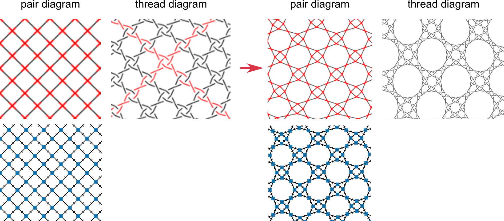
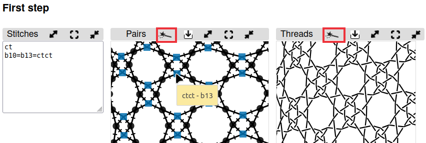
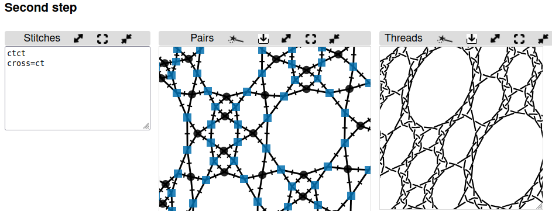

Droste effect
=============

* [Thread diagram as pair diagram](#thread-diagram-as-pair-diagram)
* [Input boxes "stitches"](#input-boxes-stitches)
* [Stitch gallery](#stitch-gallery)
* [repeat the process](#repeat-the-process)
* [Examples](#examples)

Thread diagram as pair diagram
------------------------------

In a typical pair diagram, two pairs intersect at each crossing and then continue.  In a thread diagram, two threads meet at each crossing and then continue.  So why not take a thread diagram, flatten all the over/under information, and use it as a pair diagram?  Using this technique, you can quickly create a new, usually more complex, pattern.  This process can be repeated over and over again, as long as your computer has enough power to handle the increased complexity.    In mathematics, this is called ["recursion"](https://en.wikipedia.org/wiki/Recursion).  In art, it is sometimes called the ["Droste effect"](https://en.wikipedia.org/wiki/Droste_effect).

GroundForge uses its own [color code](/GroundForge-help/color-rules) shown on the second row. 
This color-code accommodates unorthodox stitches.

The red arrow above represents a link to use the _thread diagram as pair diagram_.
As generating diagrams may be time-consuming, you have to click a  to show the thread diagram. 

Input boxes "stitches"
----------------------

The input boxes called _stitches_ have several options for specifying which stitches appear in the new thread diagram.
Grey backgrounds for diagrams indicate they are out of sync with the changes content of the input box.
As the diagrams may be slow to render, changes in the input box cause grey backgrounds for the diagrams to indicate they are out of sync.
Click the wands to update the diagrams.

By default, every stitch is `ctc`.  You can assign a new default stitch by typing the actions (such as `ct`) in the input box that appears to the left of the new pair diagram. You can also assign a stitch to every "cross" in the original thread diagram by typing `cross=...` (for example, `cross=ctcll`) in the input box.  Similarly, you assign a stitch to every "twist" in the original thread diagram using `twist=...`.  For finer control, you can specify a stitch for a specific intersection.  First find the identity of the intersection in the new pair diagram (hover over the intersection until the id appears), then give it a new value in the input box such as `b10=clcl`.  You can combine any of these options in the input box.  Use a new line or a comma to separate each instruction.

Stitch gallery
--------------

Above the first step, you can find a stitch gallery with some fields and instructions that suggest to change the pair diagram. 
In fact, it adds specifications at the bottom of the input box.
Frequently occurring stitches are better specified manually at the top of the input box.

The quick changes may cause the same id mentioned several times in the input box. 
The last occurrence is the one that counts.
To clean up you can use the search function of your browser to find duplicates in order remove the preceding ones.

Repeat the process
------------------

To repeat this process a second time, click on the  images for the second step. This will create another new thread diagram by using the thread diagram from the first level as a pair diagram. 
You may want to get the first step out of the way by [minimizing] the panels for the diagrams.
Remember to refresh the thread diagram after refreshing the pair diagram, otherwise you still get outdated results.

[minimizing]: /GroundForge-help/clips/resize

Examples
--------

Pair diagrams of several traditional grounds are very similar to thread diagrams of more basic grounds.  The following tables show a few examples.
 
 The first table uses a basic net with different stitches.   The first column shows a thread diagram of the base pattern.  The second column gives the stitches used in the _Edit Pattern_ and _First Level_ areas.  The last column lists patterns in the Whiting catalogue that either match exactly or have minor variations.  Click on the stitch definitions in the second column to open the pattern in GroundForge.

Base  | Base &rarr; First Level | First level | [Whiting catalogue](/gw-lace-to-gf)
:-----|:-----------------------:|:------------|:--------- 
  | [ct &rarr; ctct]      |  | A5, A6, B5, C6, [A7-H7,G11]
   | [ctct &rarr; ct/ctct] |    | A2, B2, B6, C6
 | [crclct &rarr; ct/ctct] |   | C6
 | [clcrclc &rarr; ctc and twists] | 
 | [ctctc &rarr; ctc and twists] |  | F2

In the following table, the "cloth motif" pattern is the base pattern.

Base  | Base &rarr; First Level    | First level     | [Whiting catalogue](/gw-lace-to-gf)
:-----|:--------------------------:|:----------------|:--------- 
   | [ctct/ctcl &rarr; ctc/tt/tctct] |  | D16
 | [ct/ctct &rarr; ct/ctct] | "tilted" rose ground

[ct &rarr; ctct]: /GroundForge/tiles?tile=-5&tileStitch=ct&droste2=ctct&patchWidth=5&patchHeight=6&shiftColsSW=-2&shiftRowsSW=0&shiftColsSE=1&shiftRowsSE=1
[ctct &rarr; ct/ctct]: /GroundForge/tiles?patchWidth=5&patchHeight=6&b1=ctct&tile=-5&footsideStitch=ctctt&tileStitch=ctct&headsideStitch=ctctt&shiftColsSW=-2&shiftRowsSW=0&shiftColsSE=1&shiftRowsSE=1&droste2=ct,cross=ctct
[crclct &rarr; ct/ctct]: /GroundForge/tiles?tile=-5&tileStitch=crclct&droste2=ctct,b16=b15=b12=ct&patchWidth=5&patchHeight=6&shiftColsSW=-2&shiftRowsSW=0&shiftColsSE=1&shiftRowsSE=1
[clcrclc &rarr; ctc]: /GroundForge/tiles?tile=-5&tileStitch=clcrclc&droste2=ctc,b16=ctct,b13=ctcr,b15=ctcl&patchWidth=5&patchHeight=6&shiftColsSW=-2&shiftRowsSW=0&shiftColsSE=1&shiftRowsSE=1
[clcrclc &rarr; ctc and twists]: /GroundForge/tiles?tile=-5&tileStitch=ctctc&droste2=ctc,B16=ctcttt,B15=ctcrrr,B14=ctclll,b13=ctcctc&patchWidth=5&patchHeight=6&shiftColsSW=-2&shiftRowsSW=0&shiftColsSE=1&shiftRowsSE=1
[ctctc &rarr; ctc and twists]: /GroundForge/tiles?tile=-5&tileStitch=ctctc&droste2=ctc,B16=ctcttt,B15=ctcrrr,B14=ctclll,b13=ctcctc&patchWidth=5&patchHeight=6&shiftColsSW=-2&shiftRowsSW=0&shiftColsSE=1&shiftRowsSE=1

[ctct/ctcl &rarr; ctc/tt/tctct]: /GroundForge/tiles?tile=8,1&a1=ctct&a2=ctcl&droste2=ctc,a24=a15=tt,a14=tctct&patchWidth=4&patchHeight=4&shiftColsSW=0&shiftRowsSW=2&shiftColsSE=1&shiftRowsSE=2
[ct/ctct &rarr; ct/ctct]: /GroundForge/tiles?tile=88,11&tileStitch=ctct&b1=ct&a2=ct&droste2=cross=ctct,twist=ct&patchWidth=6&patchHeight=6&shiftColsSW=0&shiftRowsSW=2&shiftColsSE=2&shiftRowsSE=2
[A7-H7,G11]: /gw-lace-to-gf#val

Experiment
-------------------------

For the base pattern, start with something small.  For example, enter an even number of alternating rows of `8`'s and `1`'s or `-`'s and `5`'s in the [Pattern definition](https://d-bl.github.io/GroundForge/pattern) page. Then click on the blue square of the simple layout (see below).  Next follow the link to _stitches and threads_ and finally follow the link to the _Thread diagram as pair diagram_ page. Each page has a link back to the previous page and a button to show page specific help subjects.

Remember to keep the swatch size small.  A large swatch size may be very slow. 

Try a variety of stitches in the base pattern and the first and second level patterns.
Try your own variations on the stitches show in the galleries.