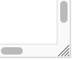

The purpose/meaning of buttons/icons in short
=============================================

 **Link**  
To a help page. Hover over the icon for the subject.

**[Reload](Undo)**  
The wand reloads only the diagrams (faster) / 
the link reloads the entire page and your browser will remember the pattern

 **Stitch**  
The character inside the circle determines the origins 
of the pairs used to make the stitch.
The default [cheat sheet](/GroundForge/images/matrix-template.png) shows all you need to assemble a pattern.
An [extended version](/GroundForge/images/matrix-template-extended.png) 
shows additional symbols used in legacy patterns.

 **Stitch enumeration**  
Click the icon for an enumeration of used stitches and their color(s).  
Droste diagrams produce plain text with a single color per stitch.
The result is an SVG download (see below) in case of the 4 color system.

 **Color code rules**  
This icon leads to the rules for a color code with up to [four colors per stitch](color-rules).  
The Droste pair diagrams still use a [single color per stitch](Color-Code).

 **Printable page**
This icon produces a page with two representations of the pair diagram
and an enumeration of the stitches. 
Arrange the space for the diagrams with the hot corner (you can hide either one or even both)
and use the print(preview) functions of your browser. 
To post-process with third party-software use a separate download for the diagram and enumeration.

**Resize space** (not to be confused with zoom or  patch size)  
Depending on the browser/device, the diagrams may have a hot corner
in the south-east, where the sliders meet.
Drag this corner to adjust the available space. 
The buttons shown here are an alternative when the hot corner is not available, for example on touch devices. 

 **Animate**  
It may bridge the difference in shapes of the holes between pattern definition and thread diagram. 
For example for [dropped stitches](Replace#drop-stitches) or irregular holes. 
An example of the latter is the TesseLace pattern [3x4_447](/GroundForge/tiles.html?TesseLace=3x4_447&patchWidth=12&patchHeight=12&tile=4-L8,-50F,56-O&shiftColsSW=0&shiftRowsSW=3&shiftColsSE=4&shiftRowsSE=0&)
which becomes surprisingly regular.
See also [reshape patterns](Reshape-Patterns).

 **[Download](Download)**  
Scalable images for 3rd party [editors](Reshape-Patterns#evaluated-editors),
or templates for an [Inkscape plugin](/inkscape-bobbinlace/).
