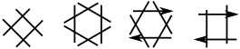

Table of contents
-----------------
* [Introduction](#introduction)
* [Symmetry introduction](#symmetry-introduction)
* [Tweak patterns](#tweak-patterns)
* [DIY patterns](#diy-patterns)
* [Hints](#hints-for-the-nets-page)

Tutorial for the Nets Page
===========

The [nets] page is a playground for (unorthodox) stitches.
The stitches are applied on the nets shown below.
Playing around can give you a first impression of the power of GroundForge.

[nets]: /GroundForge/nets

Introduction
------------

The page has two sections: stitches and diagrams. 

The stitches section has
* an input box where you can define a stitch from scratch or modify a stitch selected from the gallery
* a gallery with some arbitrary examples of stitches, the links put the stitch in the input box
* flip buttons to mirror the stitch in the input box
* a table with mirrored versions of the stitch in the input box
* a wand that updates the table and clears the diagrams

The wands in the diagrams section generate the thread diagrams.
The diagrams are divided into groups, generating all at once could choke your browser.
Please wait for the animation to complete before clicking the wand again.

Highlighting stitches can help to recognize the stitches in the diagrams.
The colours have no other meaning than to match the stitches 
in the thread diagrams with their positions in the pair diagrams.

The thread diagrams use one, two or four of the mirrored stitches shown in the table. 
With asymmetrical stitches you get more diagrams.

You can argue that the last stitches in the gallery are multiple stitches. 
GroundForge does not know how threads react to pins so everything with just two pairs is a single stitch.
Anyway, these stitches are too large for the small space per diagram.

Symmetry introduction
---------------------

It is not necessary to understand the theory of symmetry or apply it correctly
to discover interesting grounds with the [nets] page.
However, the theory can help you to understand the results.

This page was born out of curiosity about the effects of symmetry.
Investigating the theory after taking a plunge with experiments caused a surprise:
flipping on diagonal grounds works as the buttons suggest,
on square grounds you also need to change the working direction.
The details are explained on the [flip](https://d-bl.github.io/GroundForge-help/clips/flip#symmetry).
page.

Tweak patterns
--------------

The diagram links lead to pages where you can tweak the results.
The linked page starts with a button that can reveal help links.

First steps:
* Apply colour to the threads to reveal how they flow through the net.
* Adjust the number of accumulated twists.
* Adjust the number of twists for pairs entering and leaving the foot side.

The tweaking page (called stitches in the page address and _stitches and threads_ in the subtitle)
has a similar gallery of stitches (and iput box with flip buttons) as the nets page.
The difference is a [color code](color-rules) that supports unorthodox stitches.
The pair diagram next to the thread diagrams uses the same color code.

You may see cross marks in the pair diagram to indicate twists between stitches.
Hover with the cursor over the stitches to see which one is responsible for those twists. 
This way you can learn how change which stitche via the input box.
Then click the desired stitch in the pair diagram to replace it.

DIY patterns
------------

The diagrams generated on the nets page only scratch the surface of possible stitch combinations.
Even a two by two square net has more options.
For example odd numbers of two stitches out of the four mirrored stitches,
or combinations with three of the four stitches. 
With some experience with tweaking patterns, it becomes easier to create
your own patterns with those combinations stitches or even unrelated stitches.

The [embelished clothwork](https://d-bl.github.io/MAE-gf/docs/ec)
An [e-book](https://www.patreon.com/theadventurouslacemakers/shop/embellished-clothwork-ebook-by-marian-221058?source=storefront)
with the same name applies the square nets in motifs.
See also [MAE-nets](https://d-bl.github.io/MAE-gf/docs/nets) for the other nets.

Hints for the nets page
-----------------------

Changing the input box manually and using the _tab_ on your keyboard (or click anywhere on the page) 
has the same effect as the wand in the stitches section.
After selecting a stitch from the gallery, you do need the wand to update the tabel with stitches.

You can use the print button of your browser and choose destination PDF to save your diagrams.
Copy-paste content of the input box in the stitches section to reproduce the page online.