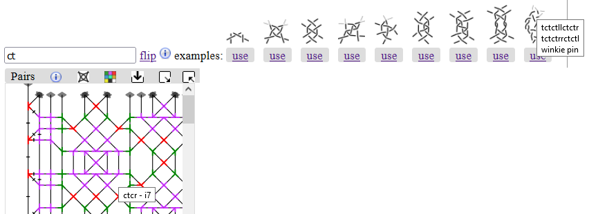
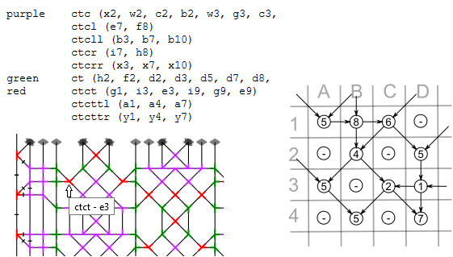

Modify stitches
=======================

Hovering over a stitch reveals the exact definition
as shown near the bottom of the screenshot above.
Clicking a stitch replaces its definition with the value
in the text field above the grey diagram caption.

As an alternative to hover, you can reveal a [legend](#legend) with the color swatch button

in the grey caption of a pair diagram to reveal a legend.
For a touch device that is your only choice to figure out the exact stitch definitions.

One color in the pair diagram may cover variations of a stitch.
Note that (unlike the belgian color code) two or more consecutive twists cause a single twist mark,
the open method (twist first) and closed method (twist last) might be mixed.

Stitch definitions
------------------

Type as many `c`'s and `t`'s for cross and twist as you need for the stitch of your choice,
or use `l`'s and `r`'s for a left twist or right twist.

Some (less) common examples are predefined for your convenience.
Click/tap a `use` link to put the definition in the text field.
Click/tap `flip` to mirror the stitch in the text field
and make further adjustments when required.

The right footside in the following example applies a flipped version
of the last predefined stitch with a few more twists.
You can [try](/GroundForge/tiles?patchWidth=3&patchHeight=8&g1=tctcttrrctct&f1=tctct&c1=ctc&b1=tctct&f2=tctct&c2=ctc&b2=tctct&a2=tctct&footside=-7,A1&tile=8,1&headside=8D,4-&footsideStitch=tctct&tileStitch=ctc&headsideStitch=tctct&shiftColsSW=-1&shiftRowsSW=2&shiftColsSE=0&shiftRowsSE=2)
variations.

Legend
------

The following illustration shows the ids in the legend, tooltips when hovering over a stitch and how to interpret them.

Drop stitches
-------------
To remove a stitch from the pattern, you can use `-` (a single dash and no other symbols) for the stitch.
If you delete all the text from a stitch field, the default value is used.  
The default stitch is the text that appears in the bottom row of boxes in _Pattern definition_, as shown in the figure above. If there is no text in this box, the default is `ctc`.

_Warning_: too many adjacent dropped stitches may cause weird thread diagrams
in which the pairs swap before a stitch is made.

Reconnected stitches
--------------------
The green annotations in the screen shot below show how the remaining stitches reconnect in the pair diagram after a dropped stitch.
One case is straight forward. In the other case, because the GroundForge pair diagram treats stitch-pin-stitch as a single stitch, the stitches are merged two by two.

The  button simulates what the pattern looks like when the connections between stitches act like springs.
The same spring behaviour is used to create the thread diagrams.  Aplying the animate button creates a pair diagram that can be used as a pricking for the thread diagram. 

You can [try](/GroundForge/tiles?patchWidth=12&patchHeight=13&g1=ctct&e1=ctct&c1=ctct&a1=ctct&f2=ctct&b2=-&g3=ctct&e3=ctct&c3=ctct&a3=ctct&h4=ctct&f4=-&d4=ctct&b4=ctct&g5=ctct&e5=ctct&c5=ctct&a5=ctct&f6=ctct&b6=ctct&g7=ctct&e7=ctct&c7=ctct&a7=ctct&h8=ctct&f8=ctct&d8=ctct&b8=ctct&tile=5-5-5-5-,-5---5--,B-C-B-C-,-5-5-5-5,5-5-5-5-,-5---5--,B-C-B-C-,-5-5-5-5,&footsideStitch=tctct&tileStitch=ctct&headsideStitch=tctct&shiftColsSW=0&shiftRowsSW=8&shiftColsSE=8&shiftRowsSE=8)
variations.

