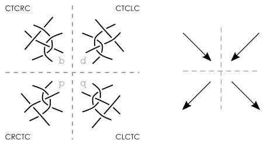
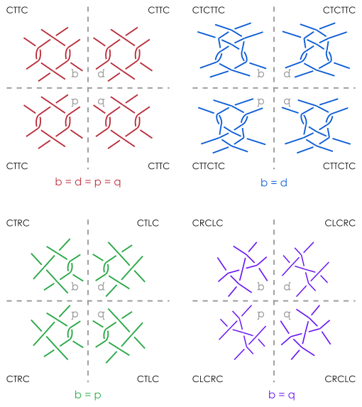
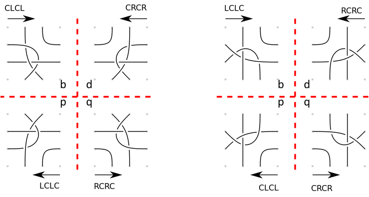
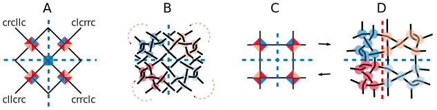

Mirrored and rotated stitches.
==============================

Soundless video clip.
---------------------

<video controls style="border: 1px solid; padding-top: 2px;">
    <source src="flip.mp4" type="video/mp4">
    Your browser does not support an inline <a href="flip">video</a>.
</video>   

The clip shows that the buttons `↔` and `↕` change the text field.
It subsequently assigns the text value to stitches in the pair diagram.

Symmetry
--------

Table of contents

* [Symmetry introduction](#symmetry-introduction)
* [Symmetry on a diagonal net](#symmetry-on-a-diagonal-net)
  * [What the flip buttons do](#what-the-flip-buttons-do)
  * [Internal symmetry](#internal-symmetry)
--* [Symmetry on a horizontal net](#symmetry-on-a-horizontal-net)
* [Wrapping up](#wrapping-up)

Symmetry on a diagonal net
--------------------------

Just an example of mirrored stitches placed on a diagonal net.
The diagram on the right shows the working directions of the stitches.

### What the flip buttons do

Mirrored representation: b ⇔ d, p ⇔ q

a. Replace each R in the with L and each L with R

    CTCRC ⇒ CTCLC

Mirrored representation: b ⇔ p, d ⇔ q

a. Read backwards  

    CTCRC ⇒ CRCTC
    CTRCTLC ⇒ CLTCRTC  

How to make the quartet of stitches

a. Apply mirror b ⇒ d  
b. Apply mirror d ⇒ q  
c. Apply mirror q ⇒ p  

    CTCRC ⇒ CTCLC  
    CTRCLC ⇒ CTLCRC  

### Internal symmetry

The following examples produce less than four different stitches by mirroring.

The mirrored representations of b and d are identical if b has no left or right twist actions (only T, no R and no L). b=d in the picture above.
The mirrored representations of b and p are identical if b is a palindrome. b=p in the picture above.
All mirrored representations d, q, p, b are identical if b has no left or right twist and is a palindrome. b=d=p=q in the picture above.

Symmetry on a horizontal net
------------------------

The working directions in a horizontal net cause challenges when flipping stitches.

In the diagrams above, b and q can only be executed on a left to right row, 
d and p on a right to left row.
Compare b of the left diagram with p of the right diagram:
only changing the working direction rotates the stitch by 45 degrees in a clockwise direction.
Compare both b's, and we see that reading the stitch instructions backwards has the same effect.

The algorithm for the flip buttons assumes stitches are placed on diagonal rows.
Applied in horizontal rows we need the following rules to avoid rotations:
* After the _both_ button: apply in a row with the same direction.
* After a `↔` or `↕`: apply in a row in opposit direction.

Wrapping up
-----------

The stitches above were drawn manually.
Below we annotated GroundForge screenshots.

You can reproduce figure D on this [nets](/GroundForge/nets.html?b=crcllc) page.
It uses the stitch _crcllc_.
You can not reproduce figure B with the nets page.
Direct links to reproduce figures:
[A+B](https://d-bl.github.io/GroundForge/stitches.html?patchWidth=12&patchHeight=12&footside=4,x&tile=-5-5,5-5-,-5-5,5-5-&headside=x,7&shiftColsSW=-4&shiftRowsSW=0&shiftColsSE=4&shiftRowsSE=4&e1=ctc&c1=cllcrc&a1=ctctctl&n2=ctctctr&d2=cllcrc&b2=cllcrc&e3=ctc&c3=cllcrc&d4=ctc&b4=ctc)
and
[C+D+F](https://d-bl.github.io/GroundForge/stitches.html?b1=cllcr&c1=crrcl&b2=rcllc&c2=lcrrc&tile=88,11&a1=rctctctctt&l2=lctctctctt&shiftColsSW=0&shiftRowsSW=2&shiftColsSE=2&shiftRowsSE=2&patchWidth=10&patchHeight=12&headside=x,7&footside=4,x).
For figure A-B we added a neutral cloth stitch between the four mirrored stitches.
In figure F we cheated: the last column of stitches is manually flipped.
Figure G zooms in and extracts a manually flipped stitch.
The flipped stitch is pale in figure F.

The fat arrow heads indicate working directions.
Each blue dashed line in A-E indicates a flip axis.
A red dashed line in C-D is not a flip axis.
Mixed dashes: flip axis for the pair diagram but not for the corresponding thread diagram.
The yellow dashed lines in B illustrate how the stitches rotate by 45 degrees to appear in D.

The small arrow heads in G show an impossible situation.
Two arrows meet one another, another goes up:
the direction of the worker pair should have flipped too.
The bright green stitch in F show the right part of G in context.
