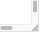

Resize panels
=============

Soundless video clip.

<video controls style="border: 1px solid; padding-top: 2px;">
    <source src="resize.mp4" type="video/mp4">
    Your browser does not support an inline <a href="resize">video</a>.
</video>

The buttons demonstrated here are an alternative when the hot corner on panels is not available, for example on touch devices.

The buttons may be convenient on desktops/laptops that do have a hot corner.
The hot corner sits in the south-east, where the sliders meet as shown below.

