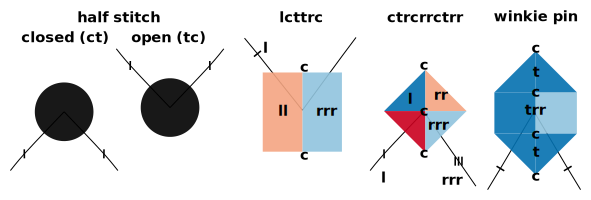
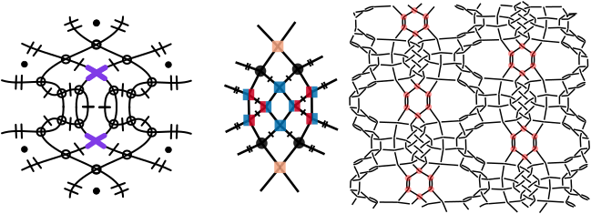
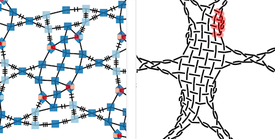
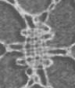
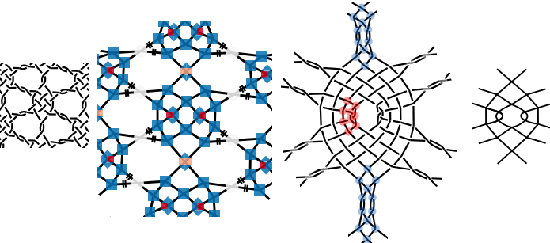

* [Why another color code?](#why-another-color-code)
* [4 colors per stitch](#4-colors-per-stitch)
  * [Twists](#twists)
  * [Crosses](#crosses)
* [Examples of stitches](#examples-of-stitches)
* [Examples of patterns](#examples-of-patterns)
* [Notes](#notes)
  * [Color scheme](#color-scheme)
  * [Open and closed methods](#open-and-closed-methods)

Why another color code?
=======================

Various dialects of color codes for pair diagrams are used by bobbin lace designers:
There is at least a [Belgian] version, a simplified [Danish] version and a [red-blue] version and perhaps more.
These dialects use just one color per stitch what accommodates at most about half a dozen of stitches.

These systems have in common that only one color represents a stitch.
These are easy to draw by hand and sufficient for traditional styles of bobbin lace.
When experimenting with unorthodox stitches and grounds we need to distinguish more than those half a dozen of colors.

[Belgian]: https://www.mail-archive.com/lace@arachne.com/msg51345.html
[Danish]: https://www.mail-archive.com/lace@arachne.com/msg51355.html
[red-blue]: https://susanroberts.info/wp-content/uploads/2019/08/Working-diagrams-part-2.pdf

4 colors per stitch
===================

This page explains how GroundForge uses up to four colors per stitch to
distinguish up to four crosses per stitch and up to three twists
between those crosses, as well as tallies and plain plaits.
If we count mirrored versions of stitches, the color code can distinguish over 4K
separate stitches. It does have one drawback: the approach may be too elaborate to 
draw accurately by hand.

Twists
------

| none| one | two | more | |
| :---: | :---: | :---: | :---: | :--- |
| ~~&nbsp;&nbsp;&nbsp;&nbsp;~~ | ~~&nbsp; ! &nbsp;~~ | ~~&nbsp; !! &nbsp;~~ | ~~&nbsp; !!! &nbsp;~~ | twists between stitches |
|   |  |  |  | twists between crosses |

Colors for the twists fill blank shapes in the following table.

Crosses
-------

| |                                                                                                                                 |
| :---: |:--------------------------------------------------------------------------------------------------------------------------------|
|  | 1. just a single cross                                                                                                          |
|  | 2. cross - twist(s) - cross                                                                                                     |
|  | 3. cross - twist(s) - cross - twist(s) - cross                                                                                  |
|  | 4. cross - twist(s) - cross - twist(s) - cross - twist(s) - cross;   e.g. brussels stitch: ctct-pin-ctct or winkie pins |
|  | `ctctctc` and longer plaits                                                                                                     |
|  | `cllcrrcllc` and longer or mirrored tallies                                                                                     |
|  | none of the above                                                                                                               |

N.B: Brussels stitches and winkie pins are single stitches for GroundForge:
they are manipulations with only two pairs.
This phenomenon is also shown below.

Examples of stitches
--------------------

The following examples combine the color rules relating to _twists_ with the shapes representing the _crosses_.
Note that each `t` of the captions is translated into an `l` plus `r` in the drawings.

Examples of patterns
--------------------

To illustrate unorthodox stitches, we compare the system developed for GroundForge 
with [B3.24](/GroundForge/droste?source=mix4snow&source=mix4snow&tile=17-w,rx-x,rx-x,rx31,-w17,-xrx,-xrx,31rx,17-w,rx-x,rx-x,rx31,-w17,-xrx,-xrx,31rx&f8=llttcrr&f16=llttcrr&footside=-----x,-----x,-----x,-----x,-----4,-----r,-----r,-----r,-----x,-----x,-----x,-----x,-----4,-----r,-----r,-----r&=undefined&u8=rrttcll&u16=rrttcll&headside=x,x,x,8,r,r,r,r,x,x,x,8,r,r,r,r&shiftColsSW=0&shiftRowsSW=16&shiftColsSE=4&shiftRowsSE=8&patchWidth=14&patchHeight=35&i1=rc&h1=ctc&g1=lcr&h2=crclcr&n5=llctt&i5=lc&g5=ct&j9=lc&h9=ctc&j13=ctc&g13=lc&g16=ctc&h16=lcr&h4=ct&h8=cr&g8=ctc&g9=lc&g12=lc&i12=ctc&j12=lcr&i13=lcr&j16=lc&j4=cr&i4=ctc&j5=ctc&i8=lc&j8=lc&i16=lcr&g4=lcr&droste2=h160=g42=j120=i162=cttc,g160=h161=g41=h13=g80=h80=g121=h93=i120=j121=i161=j133=i140=i40=i81=j53=j40=c,i122=g162=i42=g82=tctc,j131=h11=j51=h91=ctct,h162=h12=h81=h92=g83=g163=j122=j132=i123=j52=i43=j41=crc,g161=g40=h10=g81=g120=h90=i121=i160=j130=i41=i141=i80=j50=clc,i123=i43=g163=g83=lcrcl,j130=j50=h10=h90=rclcr,h13=j133=j53=h93=crr,i161=i81=g41=g121=cll,h161=h80=j40=j121=rrc,i120=i40=g160=g80=llc,u82=u162=ctc,u81=u161=tttttttctctttttt,u83=u163=tttttctc,u80=u160=tttctc#)
from [Viele Gute Gründe](MAE-gf/docs/literature).

An  in a GrounForge pair diagram may be an  in a traditional pair diagram.
This is illustrated with [highlighted](/GroundForge-help/clips/color) stitches in the thread diagrams.

Below a [variation](https://d-bl.github.io/GroundForge/stitches?whiting=F9_P185&patchWidth=26&patchHeight=26&m1=ctc&e1=ctc&o3=llcttctt&k3=cttctt&g3=ctcrrrctc&e3=ctc&c3=ctcllctc&g4=ctc&e4=ctc&i5=llctctt&g5=ctc&e5=ctc&c5=ctc&a5=rrctctt&e6=ctc&c6=ctc&o7=cttctt&k7=cttctt&g7=ctcrrctcrr&e7=ctc&c7=ctcllctcll&tile=--x-5-x---x-c-x-,-----w-----y-w--,--g-g-c---b---c-,---w8-mv-yx---xw,h-g-f-f-5-x---x-,-w8-mv---w-----y,--f-f-c---c---b-,--xw--x---xw-yx-&footsideStitch=ctctt&tileStitch=ctc&headsideStitch=ctctt&shiftColsSW=-8&shiftRowsSW=8&shiftColsSE=8&shiftRowsSE=8)
of F9 from the sampler by [Gertrude Whiting](gw-lace-to-gf).
It shows the difference between the tick marks for double and triple twists. 
The pattern shows also variations of winkie pins. One is highlighted red:
a cloth stitch, twists around a pin (not mastered by GroundForge) 
and a cloth stitch that starts the returning row. 
See also the last one in the _examples of stitches_ above.

 

The following example follows the transformation from a thread diagram
used as pair diagram to thread diagram, a [Droste effect](Droste-effect).
The last diagram is a traditional pair diagram for the eyed spider.
In the step from thread to pair diagram the double twists are reduced to a single stitch
because everything done with just two pairs is a single stitch in GroundForge.
The same would apply to a doubled cross.
The second thread diagram highlights a Brussels stitch with a blue color.
It creates a cloth stitch at the end of ona spider and another cloth stitch
at the beginning of the next spider and two twisted legs in between.
The other legs are crossed in the GroundForge pair diagram but by applying just twists
to that stitch we get parallel twisted legs.
The red highlights represent a single stitch in the GroundForge pair diagram
while it represents two stitches in the traditional pair diagram for an eyed spider.

Notes
-----

### Color scheme

The color scheme was selected from [colorbrewer](https://colorbrewer2.org/?type=diverging&scheme=RdBu&n=5)
because of its color-blind friendly properties.

### Open and closed methods

Not having twists between stitches encoded in the colors of the stitches, 
makes the diagrams agnostic to the open (start with twist) and closed (end with twist) method.
The tooltip (when hovering over a stitch) are not agnostic: they may have the twist one either one of the stitches. 
