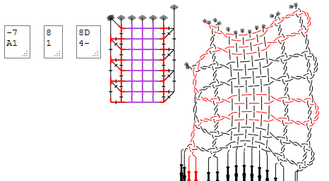

Head/foot sides
===============

The pair diagram editor provides a few examples of stitches for your convenience.
When hovering with your mouse over the last one, it gives as title "winkie pin".

Note that pins can be indicated with a `p` before a `t`,
they are rarely rendered where the should be.
Therefore, no pin is defined in this winkie pin.

GroundForge considers every sequence of actions with only two pairs as a single stitch,
that makes a winkie pin a single stitch in the pair diagrams of GroundForge.

The right footside in the following example applies a flipped version
of the last predefined stitch with a few more twists.
You can [try](/GroundForge/tiles?patchWidth=3&patchHeight=8&g1=tctcttrrctct&f1=tctct&c1=ctc&b1=tctct&f2=tctct&c2=ctc&b2=tctct&a2=tctct&footside=-7,A1&tile=8,1&headside=8D,4-&footsideStitch=tctct&tileStitch=ctc&headsideStitch=tctct&shiftColsSW=-1&shiftRowsSW=2&shiftColsSE=0&shiftRowsSE=2)
variations.

