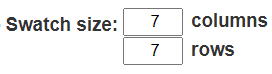
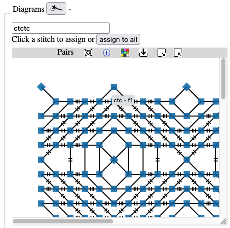

Customize diagrams
==========
+ [Highlight a thread](#highlight-a-thread)
+ [Resize pattern](#resize-pattern)
+ [Modify stitches](#modify-stitches)
+ [Undo changes](#undo-changes)
+ [Save and share changes](#save-and-share-changes)
+ [Create a new ground pattern](#create-a-new-ground-pattern)
+ [Add footsides](#add-footsides)
+ [Next steps](#next-steps)
   
Before we can customize the diagrams of a ground, we need to get one. 
For example the [diagrams] for  G-2 (column G, row 2) in the [Whiting catalogue].

[Whiting catalogue]: /gw-lace-to-gf/

[diagrams]: /GroundForge/stitches?whiting=G2_P199&patchWidth=14&patchHeight=13&f1=ctctt&a1=ctcctc&j2=ctc&i2=ctcll&h2=ctctt&g2=ctctt&f2=ctctt&e2=ctctt&d2=ctctt&c2=ctcrrr&b2=ctc&j3=ctcll&i3=ctctt&h3=ctctt&g3=ctcttl&f3=ctc&e3=ctcttr&d3=ctctt&c3=ctctt&b3=ctcrrr&a3=ctc&j4=ctctt&i4=ctctt&h4=ctcttl&g4=ctc&f4=ctc&e4=ctc&d4=ctcttr&c4=ctctt&b4=ctctt&a4=ctcttt&j5=ctctt&i5=ctcttl&h5=ctc&g5=ctc&e5=ctc&d5=ctc&c5=ctcttr&b5=ctctt&a5=ctctt&tile=5----5----,-CDD632AAB,5666632222,5666632222,56666-2222&tileStitch=ctct&shiftColsSW=-5&shiftRowsSW=5&shiftColsSE=5&shiftRowsSE=5

## Highlight a thread
For each lace ground, GroundForge displays two generated drawings: a pair diagram (with a special [Colour Code](/GroundForge-help/color-rules)) and a thread diagram. Help pages provide more information.
You can show/hide them with a button just below the banner of the page.

In the thread diagram, each thread has a small square at the start and a bobbin at the end. You may need to scroll the diagram to see them. Click on a square or bobbin to change the color of the thread. You can highlight more than one thread at a time. 
You can select another color through the square prefixed with "Thread/stitch highlights". The dialog varies per browser.

## Resize pattern

You can increase or decrease the size of the sample (also known as a "swatch") generated in the pair and thread diagrams. Above the pair and thread diagrams, change the number of columns and rows for the swatch. Note: If you make the swatch very large, performance may slow down considerably.  Read about [restrictions to the swatch size](Patch-Size) for more details. 

Every time you change the swatch size, you must regenerate the pair and thread diagrams by clicking on the  image found near the top left of the _Diagrams_ area.

## Modify stitches

To change the stitches, go to the pairs diagram in the _Diagrams_ section.
The pattern contains a vector drawing showing the order in which pairs of threads come together. 

Where two pairs come together, there is usually a square or diamond.
Follow the  for the meaning of the colors and shapes per stitch.
You can also hover over a stitch for the meaning.
This system of color coding can distinguish 147 different stitches,
the traditional color coding can distinguish only about half a dozen.

To change a stitch, type the desired new value in the field above the pattern.

For your convenience a few possibilities are predefined.
Click the `use` button of your choice to put the value in the text field,
then optionally click flip for a mirrored version and/or add twists.
Finaly click the desired stitches to change apply the instructions and change the symbol.
The diagram may disappear out of view, in that case increase the space for the diagram.
Regenerate the thread diagram by clicking on the  image.

Exercise: Try to change the center of the spider from `ctcctc` to `t`.

In addition to the usual `c` for cross and `t` for twist, you can twist only the right pair by typing `r` or type `l` to twist only the left pair. You can also "drop" a stitch. That is, when two pairs meet, do not braid them together at all. To drop a stitch, replace the stitch instructions with `-`. Be careful when dropping stitches. It can have unexpected consequences.

Exercise: Can you create the following variation? [solution](/GroundForge/stitches?whiting=G2_P199&patchWidth=20&patchHeight=20&f1=-&a1=t&j2=ctc&i2=ctclll&h2=ctctt&g2=ctctt&f2=ctctt&e2=ctctt&d2=ctctt&c2=ctcrrr&b2=ctc&j3=ctclll&i3=ctctt&h3=ctctt&g3=ctcttl&f3=ctc&e3=ctcttr&d3=ctctt&c3=ctctt&b3=ctcrrr&a3=ctc&j4=ctctt&i4=ctctt&h4=ctcttl&g4=ctc&f4=ctc&e4=ctc&d4=ctcttr&c4=ctctt&b4=ctctt&a4=ctcttt&j5=ctctt&i5=ctcttl&h5=ctc&g5=ctc&e5=ctc&d5=ctc&c5=ctcttr&b5=ctctt&a5=ctctt&tile=5----5----,-CDD632AAB,5666632222,5666632222,56666-2222&footsideStitch=ctctt&tileStitch=ctct&headsideStitch=ctctt&shiftColsSW=-5&shiftRowsSW=5&shiftColsSE=5&shiftRowsSE=5)

**Note** on the last example stitch:  
It is a counterintuitive winkie pin,
without a pin because pins are rarely placed were desired.
As long as two pair meet again without interaction with other pairs,
GroundForge interprets the actions as a single stitch.

## Undo changes

To return the pattern to its original values, click on the 'Reload' button (also called 'Refresh') at the top of your browser.

## Save and share changes

Once you have invested some time working on a lace ground, you will want to save your work. 
Use the print function of your browser to [save](/GroundForge-help/clips/print-as-pdf) the diagrams as a PDF file.
A link in the document will bring you back to the current state of the pattern.

## Create a new ground pattern

The link to “pattern definition” leads you to a page where you can modify an existing pattern or create a new pattern. First, we map the pattern onto a grid. Symbols, comprising numbers or letters, are used to draw lines on the grid. This creates a vector diagram showing the order in which pairs of threads come together. From this description, the software generates a pair diagram and a thread diagram. A more [detailed tutorial](Advanced) fully explains the many construction options available.

## Add footsides

In addition to modelling a lace ground, GroundForge can also model a footside for it. Left and right footsides are defined separately and depend on the number of columns in the patch. For example, here is [footside for Whiting G-2](/GroundForge/stitches?whiting=G2_P199&patchWidth=11&patchHeight=22&r1=ctcrr&q1=ctc&j1=ctctt&e1=ctcctc&c1=ctc&b1=ctcll&s2=ctctt&r2=ctc&q2=ctcll&p2=ctc&n2=ctc&m2=ctclll&l2=ctctt&k2=ctctt&j2=ctctt&i2=ctctt&h2=ctctt&g2=ctcrrr&f2=ctc&d2=ctc&c2=ctcrr&b2=ctc&a2=ctctt&r3=ctcrr&q3=ctc&p3=ctcrr&n3=ctclll&m3=ctctt&l3=ctctt&k3=ctcttl&j3=ctc&i3=ctcttr&h3=ctctt&g3=ctctt&f3=ctcrrr&e3=ctc&d3=ctcll&c3=ctc&b3=ctcll&s4=ctctt&r4=ctc&q4=ctcll&p4=ctctt&n4=ctctt&m4=ctctt&l4=ctcttl&k4=ctc&j4=ctc&i4=ctc&h4=ctcttr&g4=ctctt&f4=ctctt&e4=ctcttt&d4=ctctt&c4=ctcrr&b4=ctc&a4=ctctt&r5=ctcrr&q5=ctc&p5=ctctt&n5=ctctt&m5=ctcttl&l5=ctc&k5=ctc&i5=ctc&h5=ctc&g5=ctcttr&f5=ctctt&e5=ctctt&d5=ctctt&c5=ctc&b5=ctcll&s6=ctctt&r6=ctc&q6=ctcll&c6=ctcrr&b6=ctc&a6=ctctt&s7=ctctt&r7=ctcrr&q7=ctc&p7=ctctt&d7=ctctt&c7=ctc&b7=ctcll&a7=ctctt&r8=ctc&q8=ctcll&p8=ctcll&d8=ctcrr&c8=ctcrr&b8=ctc&s9=ctctt&r9=ctcrr&q9=ctc&p9=rr&d9=ll&c9=ctc&b9=ctcll&a9=ctctt&r10=ctc&q10=ctcll&p10=ctcrr&d10=ctcll&c10=ctcrr&b10=ctc&footside=X14-,4886,-111,B883,X111,488-,1115,X786,1114,X786&tile=5----5----,-CDD632AAB,5666632222,5666632222,56666-2222&headside=-78X,2117,888-,311C,888X,-117,5888,214X,7888,214X&footsideStitch=ctc&tileStitch=ctctt&headsideStitch=ctctt&shiftColsSW=-5&shiftRowsSW=5&shiftColsSE=5&shiftRowsSE=5).
There is a separate tutorial on how to [create footsides](Advanced#foot-sides).

## Next steps

* Experiment with four snowflake variations in [Binche Kompakt: ground number 31](Binche).
* [Create a pattern](Advanced)
* Learn about [the Droste effect](Droste-effect)
