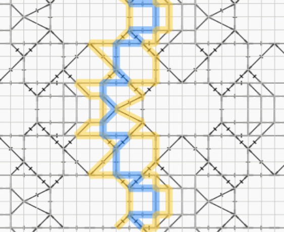

Kissing pairs
=============

A kissing path follows one set of pairs through the pair diagram.
When two pairs intersect, the kissing path does not cross over to the other side,
it just touches the other pair (“kisses”) and continues.
You can think of it as the path that a pair of threads follows
if a turning stitch (cttct) is used at each intersection. 

The kissing path of a pair bounces between its neighbours. 

An example with [GW-4](/GroundForge/tiles?whiting=G4_P201&patchWidth=40&patchHeight=19&i1=ctctt&f1=ctc&e1=ctc&d1=ctc&c1=ctc&a1=ctctt&g2=ctc&i3=ctc&f3=ctc&e3=ctc&d3=ctc&c3=ctcll&a3=ctctt&n4=ctctt&l4=ctctt&j4=ctctt&h4=ctctt&f4=ctt&d4=ctcll&c4=ctcll&b4=ctctt&g5=ctctt&c5=ctctt&n6=ctctt&j6=ctctt&m7=c&k7=ctc&j7=ctc&i7=ctctt&g7=ctctt&e7=ctctt&c7=ctctt&a7=ctctt&tile=5-m998-z5-----,------5-------,g-aaab-wd-----,-246-m-l-o-k-e,--5---5---y-w-,---w-y---b---c,h-g-5-n-l3h-e-,&footsideStitch=ctctt&tileStitch=ctc&headsideStitch=ctctt&shiftColsSW=-7&shiftRowsSW=7&shiftColsSE=7&shiftRowsSE=7)

This phenomenon can help to solve problems.
Such as:

* Add a [foot side](/GroundForge-help/Advanced#footside-tutorial)
  or split a pattern.
* Pinch to [add a stitch](/GroundForge-help/symmetry/#add-stitches)
  and not create a sewing.