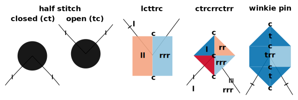

Number of stitches
------------------

| none| one | two | more | |
| :---: | :---: | :---: | :---: | :--- |
| ~~&nbsp;&nbsp;&nbsp;&nbsp;~~ | ~~&nbsp;&nbsp;!&nbsp;&nbsp;&nbsp;&nbsp;~~ | ~~&nbsp;&nbsp;!&nbsp;&nbsp;~~ | ~~&nbsp;&nbsp;!!!&nbsp;&nbsp;~~ | twists between stitches |
|   |  |  |  | twists between crosses |

Crosses
-------

1.  just a single cross
2.  cross - twist(s) - cross
3.  cross - twist(s) - cross - twist(s) - cross

*  ctctctc and longer plaits
*  cllcrrcllc and longer or mirrored tallies

Examples
--------

