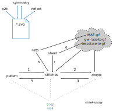

The banner of each page links to the [home page](https://d-bl.github.io/),
as does the explicit home link in the various sidebars.
This home page gives a descriptive overview of entry points.

Below a navigation overview with the names of the pages as they appear in the address bar of your browser.
Some pages are prefixed with _d-b.github.io/GroundForge/_, others with just _d-b.github.io/_.
Page _sheet_ is not in the descriptive overview.
It is a page for pricking variations, the generated thread diagrams are supposed to be identical.

The help pages would clutter the overview.
The pages _pattern_, _stitches_ and _droste_ have a button that can hide/show a help menu.
The other pages have a single link or a short story linking to tutorials.

Arrow legend
------------

* blue: download/upload alias import/export
* black: common routes via links
* grey: less common routes via links
* dashed: recovery for third party sites, they may link to an obsolete page

Known third party pages/sites
-----------------------------

* https://groups.io/g/GroundForge/
* https://groups.io/g/pointfusion/
* https://kantelier.wordpress.com (posts may have old links)
* https://gibritte.over-blog.com/search/groundforge/
* https://gibritte2.blogspot.com/search?q=GroundForge
* IOLI [challenge 5](https://lacechallenge.internationalorganizationoflace.org/#h.ouc3mhbkvsi5)
* pinterest / facebook / instagram / discord / . . .
* Courses by Veronika Irvine, TAL, ...
* Scientific papers by [Veronika Irvine](https://orcid.org/0000-0002-9455-8712) and [others](https://dl.acm.org/doi/10.1145/3689050.3704957)

See also [404](https://d-bl.github.io/GroundForge/404)

