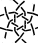

Too many possibilities
============

From [counting snow](/MAE-gf/docs/counting-snow/)
we know that six pair snowflakes can change the order of threads in 230 ways.
Each reordering can be achieved in multiple ways.
[Capturing](/GroundForge-help/Reversed-engineering-of-patterns#recognize-patterns)
them all is therefore impossible.
The [snow mixer](/GroundForge/mix4snow) provides a few dozen
and a tutorial to create variations and new ones.

More freedom with two droste steps
================

The mixer uses only one [droste](Glossary#droste) step to choose stitches for six pair snowflakes.
You can choose to assign stitches to a single snowflake, or to four.
With two droste steps you have more options, only limited by your creativity.

You can select any pattern from any catalogue and use plaits with three threads as stitches,
for example _lclc_ or _rcrc_ between other stitches (or not). This could look as shown on the right.

Let us take a mixer recipe as an example.  
 is:  _left; tc,rclcrc,clcrcl,ct_   
You can apply the recipe after following the link to _thread diagram as pair diagram_.
In this case you also need a flipped verison of the recipe.
The first step looks like below.

  
[show](https://d-bl.github.io/GroundForge/droste.html?patchWidth=18&patchHeight=35&tile=5-5-5-,-5-5-5,5-5-5-,-5-5-5,5-5-5-,-5-5-5&shiftColsSW=0&shiftRowsSW=6&shiftColsSE=6&shiftRowsSE=6&e1=ctc&c1=ctc&a1=ctc&f2=ctc&d2=ctc&b2=ctc&e3=ctc&c3=crcr&a3=ctc&f4=ctc&d4=ctc&b4=ctc&e5=clcl&c5=ctc&a5=ctc&f6=ctc&d6=ctc&b6=ctc&&droste3=tc,lcrclc,crclcr,ct&droste2=,c30=tc,c31=rclcrc,c32=clcrcl,c33=ct,e50=tc,e51=lcrclc,e52=crclcr,e53=ct)

You don't need to edit the text box, type the desired stitch,
then click a stitch in the pair diagram to apply.
As this page can be very slow, the diagrams are re-rendered after you click the wand.
Changes are highlighted grey until you do. 

Note that for the second step, you need to re-render the pair diagram
before re-rendering the thread diagram. Otherwise, the changes don't appear. 

Double worker pairs
===================

Another example turns the worker pair of the initial pair diagram
into two workers going together from left to right, 
negotiate a footside and return together through the next row of snowflakes.

  
[show](https://d-bl.github.io/GroundForge/droste?b1=rcrc&b2=lclc&c1=rcrc&c2=lclc&g1=rcrc&g2=lclc&tile=8,1&shiftColsSW=0&shiftRowsSW=2&shiftColsSE=1&shiftRowsSE=2&footside=-5,b-&headside=-c,5-&a2=-&h1=-&patchWidth=4&patchHeight=6&droste2=b10=c10=g10=rclc,b11=c11=g11=ctc,b12=c12=g12=ctc,b13=c13=g13=crcl,b20=c20=g20=lcrc,b21=c21=g21=ctc,b22=c22=g22=ctc,b23=c23=g23=clcr&droste3=ctc,b133=b233=c133=c233=g133=33=g233=ctcttctc#)