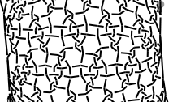

Snow with two droste steps
==========================

* [More freedom](#more-freedom)
* [How to](#how-to)
* [Double worker pairs](#double-worker-pairs)
* [Spidery/Snowy/Asymmetrical connections](#spiderysnowyasym-connections)
* [3/6 pair recipes](#36-pair-recipes)
* [4/8 pair recipes](#48-pair-recipes)

More freedom
------------

With two [droste](Glossary#droste)  steps you have way more options
to combine snowflakes than with the [snow mixer](/GroundForge/mix4snow).
The mixer only allows to assign stitches to one or four snowflakes.
The price for the freedom: more steps to apply a predefined recipe,
that takes only two clicks with the mixer.

How to
------

You can select any pattern from any catalogue and use plaits with three threads as stitches,
for example _lclc_ or _rcrcrc_ between other stitches (or not). 
This looks like highlighted in the image on the right.

Let us take a mixer recipe from the [table](#36-pair-recipes) as an example.  
 which is:  _lclc; tc,rclcrc,clcrcl,ct_ and flipped: _rcrc; tc,lcrclc,crclcr,ct_    
Apply the _lclc_ and/or _rcrc_ stitches on the [stitches] page.
You can apply the rest of the recipe after following the link to _thread diagram as pair diagram_.

[stitches]: /GroundForge/stitches?patchWidth=18&patchHeight=35&tile=5-5-5-,-5-5-5,5-5-5-,-5-5-5,5-5-5-,-5-5-5&shiftColsSW=0&shiftRowsSW=6&shiftColsSE=6&shiftRowsSE=6&e1=ctc&c1=ctc&a1=ctc&f2=ctc&d2=ctc&b2=ctc&e3=ctc&c3=crcr&a3=ctc&f4=ctc&d4=ctc&b4=ctc&e5=clcl&c5=ctc&a5=ctc&f6=ctc&d6=ctc&b6=ctc&&droste3=tc,lcrclc,crclcr,ct

  
[show](/GroundForge/droste?patchWidth=18&patchHeight=35&tile=5-5-5-,-5-5-5,5-5-5-,-5-5-5,5-5-5-,-5-5-5&shiftColsSW=0&shiftRowsSW=6&shiftColsSE=6&shiftRowsSE=6&e1=ctc&c1=ctc&a1=ctc&f2=ctc&d2=ctc&b2=ctc&e3=ctc&c3=crcr&a3=ctc&f4=ctc&d4=ctc&b4=ctc&e5=clcl&c5=ctc&a5=ctc&f6=ctc&d6=ctc&b6=ctc&&droste3=tc,lcrclc,crclcr,ct&droste2=,c30=tc,c31=rclcrc,c32=clcrcl,c33=ct,e50=tc,e51=lcrclc,e52=crclcr,e53=ct)

Compare the text box and thread diagram of the screenshot with the recipes.
You don't _need_ to edit the big text box,
but in this case it can be easier to copy-paste the recipe
and edit to get something like the screenshot.
The start of the ID-s like _c3_ and _e5_ depend on your pattern and where you applied the plait stitches.
The number of lines depend on the number of stitches in your snowflake recipe.
After applying the broomstick, the lines will get reorganized and the recipe no longer recognizable.

Even when changing stitches by clicking the thread diagram,
you need the wand to re-render the diagrams because this page can be very slow.
Outdated diagram parts are highlighted grey and black until rerendering.

Note that for the second step, you need to re-render the pair diagram
before re-rendering the thread diagram. Otherwise, the changes don't appear. 

Double worker pairs
-------------------

Another example turns the worker pair of the initial pair diagram
into two workers going together from left to right, 
negotiate a footside and return together through the next row of snowflakes.

[show](https://d-bl.github.io/GroundForge/droste?b1=rcrc&b2=lclc&c1=rcrc&c2=lclc&g1=rcrc&g2=lclc&tile=8,1&shiftColsSW=0&shiftRowsSW=2&shiftColsSE=1&shiftRowsSE=2&footside=-5,b-&headside=-c,5-&a2=-&h1=-&patchWidth=4&patchHeight=6&droste2=b10=c10=g10=rclc,b11=c11=g11=ctc,b12=c12=g12=ctc,b13=c13=g13=crcl,b20=c20=g20=lcrc,b21=c21=g21=ctc,b22=c22=g22=ctc,b23=c23=g23=clcr&droste3=ctc,b133=b233=c133=c233=g133=33=g233=ctcttctc#)

Spidery/Snowy/Asym connections
------------------------------

Traditionally, spiders start with two groups of pairs, and they have two groups of leaving pairs.
Traditional six pair snowflakes have three groups of starting/leaving pairs.
With the droste method we get asymmetrical connections for 3/6 pair connections.

[spidery](https://d-bl.github.io/GroundForge/stitches?patchWidth=12&patchHeight=20&c1=ct&a1=ct&b2=ct&c3=ct&a3=ct&d4=ct&b4=ct&tile=5-5-,-5--,B-C-,-5-5&footsideStitch=ctctt&tileStitch=ct&headsideStitch=ctctt&shiftColsSW=-2&shiftRowsSW=4&shiftColsSE=2&shiftRowsSE=4):
 &nbsp;
[snowy](https://d-bl.github.io/GroundForge/stitches?patchWidth=12&patchHeight=20&b1=clcrc&a1=c&d3=clcrclll&a3=cttt&c4=c&b4=crclc&d6=crclcrrr&c6=cttt&tile=76x-,yxxy,6-x4,x24-,xxww,x-27&tileStitch=ctct&shiftColsSW=0&shiftRowsSW=6&shiftColsSE=4&shiftRowsSE=6): 
 &nbsp;
[asymmetrical](https://d-bl.github.io/GroundForge/stitches?patchWidth=10&patchHeight=14&tile=5-5-,-5-5&shiftColsSW=-2&shiftRowsSW=2&shiftColsSE=2&shiftRowsSE=2&c1=ct&a1=rcrc&d2=cr&b2=ct):

Note that with 4/8 pairs we can't divide the pairs into three groups, so we need more to distinguish spiders from snow.

3/6 pair recipes
----------------

The table below shows the [snow mixer](/GroundForge/mix4snow) recipes in a format suited for two droste steps explained above.
From an overview on the [counting snow](/MAE-gf/docs/counting-snow/#no-bouncing)
page, we learn that this gallery covers very little of the possible six pair connections,
see [tweak recipces](../#recipes-for-the-mixer) for more variations.

**Under construction**  
With two droste steps, we should not need a leading dash
for an odd number of stitches to make it an even number.
The dash (meaning: skip a stitch) is an accidental feature
and can cause problems outside the mixer. 

| **3-pair thread diagram** | **recipe of the diagram**                     | **flipped recipe**            |
|---------------------------|:----------------------------------------------|:------------------------------|
|             | rcrcrc   crc,crclctc,ctcrc,rcl,c,c         |                               |
|             | lclclc   rcl,ctc,crcllc,crrclcr,ctc,cl     |                               |
|             | rcrcrc   -,ctc,ctc,ctc,ctc,ctc             |                               |
|             | lclc   tctc,rctcl,ctcl,ctct                |                               |
|             | lclc   tc,rclcrc,clcrcl,ct                 | rcrc   tc,lcrclc,crclcr,ct |
|             | rcrc   tcr,lctc,ctcr,lct                   |                               |
|             | rcrc   tcl,lctc,ctcr,rct                   |                               |
|             | rcrc   t,lctc,ctcr,ctct                    |                               |
|          | lclclc   -,c,ctctc,ctctc,ctctc,c           |                               |
|          | lclclc   t,rc,ctc,rclcr,ctcl,ct            |                               |
|          | lclc   t,rctc,ctctcl,ctct                  |                               |
|          | rcrcrc   -,cr,crcl,clcrclcr,rcrcl,c        |                               |
|          | lclclc   cr,crcl,clcr,crcl,clcr,c          |                               |
|          | rcrcrc   -,cr,crcl,clcr,crcl,cl            |                               |
|          | lclclc   -,cl,ctcl,crcrcr,rcr,c            |                               |
|          | lclclclc   -,lc,crc,clcrc,clcr,c,crc,cl    |                               |
|          | rcrcrc   -,cr,ctcr,clclc,lcl,c             |                               |
|          | rcrcrc   ctct,ct,ct,ct,cl,ctc              |                               |
|          | rcrc   lc,crclclc,crcrclc,cr               |                               |
|          | rcrcrc   cr,ctcl,ctcr,ctcl,ctc,c           |                               |
|          | rcrc   r,lrc,ctcr,lct                      |                               |
|          | rcrcrcrc   c,ctc,rclc,ctc,rc,rcl,ctc,c     |                               |
|          | lclc   rc,clcrc,clctc,rcl                  |                               |
|          | rcrc   lcrc,clcrc,clcrc,clcr               |                               |
|          | rcrcrc   -,c,ctctc,clcr,rctc,c             |                               |
|          | lclclclc   r,c,crc,ctc,lcrcl,ctc,crc,cl    |                               |
|          | lclclc   -,ctc,ct,crc,ctc,ctc              |                               |
|          | rcrcrc   -,cl,ctctcr,ct,ctc,c              |                               |

4/8 pair recipes
----------------

It is even less possible to be exhaustive for 4/8 pair recipes.
The table below is just a start.
See also [MAE-gf](/MAE-gf/docs/spin_08).

The first example is a traditional 
[spider](GroundForge/droste.html?patchWidth=6&patchHeight=6&footside=------,-----b,&tile=5-&headside=c,-&shiftColsSW=-2&shiftRowsSW=0&shiftColsSE=1&shiftRowsSE=1&m1=ctctt&g1=ctcctct&f2=ctctt&droste2=g18=g19=tt,g13=ctcctc&droste3=g180=g181=g190=g191=tt,g133=ctcctc).
Note that leading/trailing twists in the initial stitch cause crossed legs in the pair diagram of the first droste step.
Assigning just twists to these stitches nicely separates the legs into twisted pairs.
Due to the nature of the droste effect, that effect repeats in the second droste step.

The initial stitch in the second example uses all twists for the "[bolletje](https://d-bl.github.io/GroundForge/droste.html?patchWidth=6&patchHeight=6&footside=------,-----b,&tile=5-&headside=c,-&shiftColsSW=-2&shiftRowsSW=0&shiftColsSE=1&shiftRowsSE=1&m1=ctctt&g1=rctcr&f2=ctctt&droste3=,g120=tt,g110=tt,g129=tt,g144=tt&droste2=g15=c,g10=cl,g14=clcrll,g13=crclcrcl,g11=llclcr,g12=llclcrclcll#)".
So we can't use the crossed legs trick in the first droste step,
we have to add the legs to other stitches.
The four ll's in three stitches of the first droste step become the twisted legs in the second droste step.

Note that repeated actions (repeated twists or repeated crosses)
become a single stitch when a thread diagram is used as pair diagram.

Note also that the [blob analysis](/GroundForge-help/snow-mix/#blob-analysis)
(to capture new spiders/bollletjes) needs slightly different rules. 
The blobs are not only left or right, we also have blobs in the center.

The recipes in the table can be applied to this [pattern](https://d-bl.github.io/GroundForge/stitches.html?patchWidth=6&patchHeight=6&footside=------,-----b,&tile=5-&headside=c,-&shiftColsSW=-2&shiftRowsSW=0&shiftColsSE=1&shiftRowsSE=1&m1=ctctt&g1=ctct&f2=ctctt).

| **initial stitch** | **first droste step**                                                                    | **second droste step**                                    |
|--------------------|------------------------------------------------------------------------------------------|-----------------------------------------------------------|
| ctcctct            | g13=ctcctc   g18=g19=tt                                                               | g133=ctcctc   g180=g181=g190=g191=tt                   |
|    |                                            |                                     |
| rctcr              | g15=c   g10=cl   g14=clcrll   g13=crclcrcl   g11=llclcr   g12=llclcrclcll | g100=g150=c   g110=g120=g128=g144=tt  |
| ctct               | g11=g12=ctctc   g14=g15=tt                                                            |                                            |
| ctct               | g12=ctclctc   g11=ctcrctc   g14=g15=tt                                             |                                |
