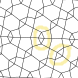
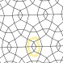
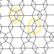

Snowflake experiments
=====================

* [A little history](#a-little-history)
* [Three pair joins in other patterns](#three-pair-joins-in-other-patterns
* [6 pairs with all pairs entering before leaving](#6-pairs-with-all-pairs-entering-before-leaving)
* [6 pairs, on both sides a pair leaves before the last enters](#6-pairs-on-both-sides-a-pair-leaves-before-the-last-enters)

A little history
----------------

After [counting snowflakes](/MAE-gf/docs/counting-snow/)
some experiments were done to explore members of the snowflake families and apply stitches.
The [snow mixer](/GroundForge/mix4snow) emerged from these experiments. 
In turn that lead to replace the old pair diagram style on the droste page
into a clickable version, which in turn lead to the
[snow with two droste steps](../droste) page.

This page collects the experiments that did not (yet?)lead to new features or procedures.

Three pair joins in other patterns
----------------------------------

A trained eye can recognize three pair joins in various patterns.
On the right some fragments, below some highlighted examples.
These examples where found in patterns from different catalogues.

In these situations you can apply the recipes that consist of four stitches.
Recipes with a leading dash may not always work well:
Pairs might change position before the stitch is worked.
A droste step would create six pair snowflakes from these pattern snippets.

 &nbsp;
 &nbsp;
 &nbsp;

In a Paris ground (under construction)
--------------------------------------

The [tutorial](/GroundForge-help/Binche) with a Binche ground captured the pair diagram directly.
When using the thread diagram of this [pattern](/GroundForge/stitches.html?patchWidth=19&patchHeight=16&tile=-5-,6-5,-5-,5-5,-58,5-4&shiftColsSW=0&shiftRowsSW=6&shiftColsSE=3&shiftRowsSE=3&b1=ct&c2=ct&a2=cllcr&b3=cl&c4=ctc&a4=ct&c5=-&b5=crrcl&c6=ctc&a6=cr&droste2=ctc,c20=c21=b30=b31=c22=a60=a61=a42=b11=ctct,b53=b10=b12=rctct,a23=a40=a41=lctct)
as pair diagram, we also get snowflakes in a Paris ground.
You only need the first step of the _pair diagrams from thread diagrams_ page.
Definition for the ring pair at the first _pair diagrams from thread diagrams_ step:

    ctc
    c20=c21=b30=b31=c22=a60=a61=a42=b11=ctct
    b53=b10=b12=rctct
    a23=a40=a41=lctct

The screenshot dropped the stitch marked with a grey `+`,
for more variations you can restore the stitch with the button `assign to ignored`.
The highlighted stitches in the thread diagram represent the blobs.
The configuration of blobs is not as versatile as for the form above.

6 pairs, on both sides a pair leaves before the last enters (under construction)
--------------------------------------------------------------------------------

We explore two snowflakes to demonstrate the two templates. The dashed lines indicate bouncing pairs:
these pairs leave the snowflake before last pair enters.
It might be a bit confusing, but the snowflake is still a 6-pair snowflake.
In reality the pairs might not return but play another role in the rest of the lace while another pair "returns".

 <!-- TODO content beyond the visible area is more related to the counting-snow page -->

In the first example above (lct-tcr), each bouncing pair section (the dashed lines) interacts with just one other bouncing pair section.
In the second example we see more interactions between the bouncing pairs.
The first example requires two stitches to define a thread diagram to be used as pair diagram, the second one requires three stitches.

The following form generates the diagrams shown below the form.
Note the subtle difference for the open and closed connection in diagram variations for the three-stitch example.
Follow the link to "_thread diagram as pair diagram_" to select your stitches for the snowflake.

<form style="background-color: #EBEBEB">
    First bounce on the
    
        <input type="radio" name="first-bounce" value="r" id="first-bounce-right" checked onchange="update()">
        <label for="first-bounce-right">right</label>
         
        <input type="radio" name="first-bounce" value="r" id="first-bounce-left" onchange="update()">
        <label for="first-bounce-left">left</label>
    
    &nbsp;
    Connection
    
        <input type="radio" name="conn" value="l" id="conn-closed" onchange="update_bounce()">
        <label for="conn-closed">closed</label>
         
        <input type="radio" name="conn" value="r" id="conn-open" onchange="update_bounce()" checked>
        <label for="conn-open">open</label>
    
    <input type="text" id="bounce-blobs" name="blobs" width="35" spellcheck="false" onchange="update_bounce()" value="lcr,rccl,lcr">
    <a id="bounce-link" href="#" target="_blank">
        <button type="button">show diagram</button>
    </a>
</form>

The number of legs is deceptive, caused by the bouncing pairs.
We can get more realistic lengths for the legs at the next step.
The screenshot on the right shows manually added red pins to indicate the actual legs.
