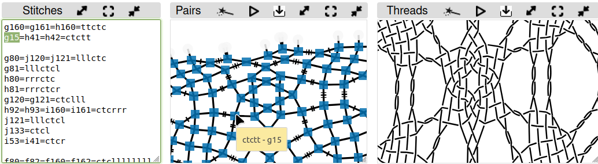
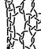
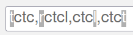
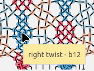
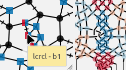
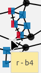
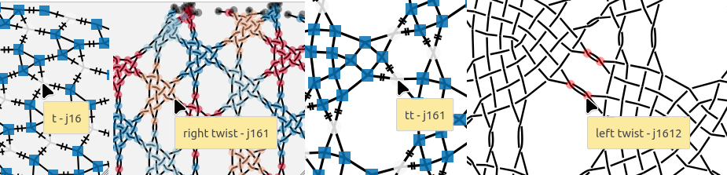
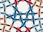
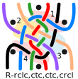

Toc
===
* [Mix snowflakes into new Grounds](#mix-snowflakes-into-new-grounds)
  * [Stitches for six pair snowflakes](#stitches-for-6-pair-snowflakes)
  * [Footsides](#footsides)
  * [Footside detour navigation](#footside-detour-navigation)
  * [Recipes for the mixer](#recipes-for-the-mixer)
    * [Modify a given recipe](#modify-a-given-recipe)
    * [Even numbers of stitches](#even-numbers-of-stitches)
  * [Create a recipe from scratch](#create-a-recipe-from-scratch)
    * [Step by step](#step-by-step)
    * [Blob analysis](#blob-analysis)

Mix snowflakes into new Grounds
===============================

On the [snow mixer] you can create diagrams for (new) grounds with a mix of 2x2 snowflakes.
Below the form you find links to the most important subjects to have fun with the mixer.

On the left a sample of lace by Babette.
She invented a double hexagonal ring pair around a snowflake.
The intersections of the double ring pairs are in fact compact snowflakes.
This inspired to explore a mix of snowflakes in general.

The pair diagram of a 6-pair snowflake can be interpreted
as a thread diagram of a 3-pair connection.
Each 3-pair connection can be composed with a group of 2-pair stitches.
The mixer starts with the last step as building blocks alias recipes for a combination of 2x2 snowflakes.

[snow mixer]: /GroundForge/mix4snow/

Stitches for 6-pair snowflakes
------------------------------

The mixer generates thread diagrams for 3-pair stitches.
Using such a thread diagram as a pair diagram,
allows to assign stitches for 6-snowflakes,
spiders or whatever needs 6 pairs.

On the right you see the default pattern of the [snow mixer].

* Click the button _pair diagrams from thread diagrams_ on the mixer page,
  and you will see the screenshot below with an empty thread diagram.
* Click wands to (re)generate diagrams.
* [Play](/GroundForge-help/Icons)
  with the size of the panels and move the content as you see convenient.
* The mouse in the screenshot points to the stitch that is highlighted with green in the stitches panel.
* You can set defaults manually at the start of the stitches panel and add lines at the bottom 
  with (variations of) [predefined stitches](io/GroundForge-help/clips/flip) above _Step 1_.

To get a less stretched look (for screenshots or PDF documents) you can resume the animation.

Please note the pattern examples on the [color rules](/GroundForge-help/color-rules)
for '_g15_' in the screenshot above and see also the page specific help links.

Footsides
---------

A footside that works for one set of recipes may not work for another.
This has to do with footside twists that may or may not collapse
with ground twists or vice versa.
These collapsing stitches are explained with example patterns on the [color rules](/GroundForge-help/color-rules) page.

The default footside is based on a _crc_.
To choose another stitch as a footside basis you need a detour.
Go via the link-button _tweak footsides_ in the mixer
before you go to the _pair diagrams from thread diagrams_ page.
On this intermediate page you will see the thread diagram without highlights.
The pair diagram on the intermediate page allows to replace the footside stitches, 
other stitches too, but you could have done that on the mixer page.

On the right a simplified pattern (blue) without collapsed twists
and a _tct_ as basis (give or take a twist) as shown between the bobbins.
This basis gives you more options.
The two different footsides have each their own consequences for the flow of threads.

The example on the left has a _rclcrclcr_ as basis, again give or take a twist at the start or end.
A passive (red line)  more or less is not significant to control the thread flow,
but you might want more pairs for more elaborate footsides.
For that purpose you need another detour.
The  _stitches and threads_ page has a link "back" to the _pattern definition_ page.
That page has room for five more pairs in the left footside. See this [advanced] technique.
The _pattern definition_ page has a link to the _stitches and threads_ page.
The links back and forth preserve the pattern from the mixer page as long as you
did not change the number of columns for the left footside.
Both detour pages give you a chance to adjust the [swatch size] and have links to return.
See the _show help links_ buttons on the detour pages.

An example with the most advanced footside technique:  
  pattern page <textarea rows="3" cols="6" spellcheck="false">----xx
----xx
----xx
----xx
----4y
----rx
----rx
----r8
----xx
----xx
----xx
----xx
----4y
----rx
----rx
----r8</textarea> stitches page: _clcrclc_ and _lcrcl_

When comparing the two footsides on the left, we see that one creates
more distance between the legs of one snowflake
the other creates more distance between the legs of two adjacent snowflakes.

<!-- TODO develop recipes from simplified  -->
[swatch size]: /GroundForge-help/Patch-Size
[simplified]: /GroundForge/droste?patchWidth=1?patchWidth=1&patchHeight=15&footside=4,x&tile=-,5&headside=7,x&shiftColsSW=0&shiftRowsSW=2&shiftColsSE=1&shiftRowsSE=2&c1=lctrr&a1=rctll&b2=ctc&droste2=c10=c11=c12=tctctct,c13=rrtctctct,a10=tctctctc,a11=ctctctc,a13=ctctct,a12=lllctctctctc#
[advanced]: /GroundForge-help/Advanced#footside-tutorial

Footside detour navigation
-------------------------

The grey arrows below show the possible detour routes to tweak the footsides,
the black arrows show the normal work flow for the snow mixer.
The route along 4-5 is optional in the detour and the most advanced.
The names of the pages in this overview appear in the address bar of the browser.

Links:  
1. 6 pair snow  
2. Back to original _pair diagram_ (in another context this links goes to the _stitches_ page)   
3. Tweak footside  
4. Back to the _pattern definition_  
5. Use the pattern below to experiment with _stitches and threads_.  
6. Use the _thread diagram as pair diagram_.  

When you visit the droste page another time, stitches defined for a previous pattern may no longer be valid.
Even when you vist the droste page for the first time, you inherit stitches from the default pattern that may not be valid for your pattern.

Recipes for the mixer
---------------------

The [snow mixer] shows a galley of recipes with thumbnails.
The collection is just to get you started as we can barely scratch the surface of the possibilities.
To get more at your fingertips with a smaller set, we leave out look a likes
that are (relatively) simple modifications of others.
Some gallery items make look only tilted, but the difference in the recipe may not be trivial.

For an impression about the numbers:
The page [counting snow families](https://d-bl.github.io/MAE-gf/docs/counting-snow/)
has 230 families for the type of snowflakes for the mixer.
For the next step, the counting page explores two families with [recipes](MAE-gf/docs/counting-snow/#exploring-families).
These examples are not exhaustive.
Did your think [Viele gute Gründe](/MAE-gf/docs/literature)
has a lot of snowflakes in the B3 series?
About half of them are members of only 2 families and need only 17 recipes.
The other half is member of 25 families with an average of almost 3 samples per family.
This leaves 203 families not explored at all.

### Modify a given recipe

(Un)twisting the legs of a snowflake recipe is a relatively easy modification.
Just play with the highlighted characters in the recipe box as shown below:
two twists to play with for the first/last stitch, one for the second first/last.
The other twist for the second first/last stitch is (usually?) inside the snowflake.

Note that you can also use dots as separators between the stitches.
Harder to see but easier to type on a mobile device. Spaces are ignored. 

The following list of steps explains an approach to remove other stitches.
As an example, the steps remove the center of a spider as shown in dark blue in the thread diagrams below.
These steps show some hover actions.
A mobile device does not support hovering, it requires a little more trial and error.
Click the blue hexagon again when you guessed wrong with removing the color.

* The gallery of recipes has the dark blue snowflake in the thread diagrams of figure (a) and (b).
* Click or tap on it in the gallery and the content of the recipe box should change.
* Click the dark blue hexagon.
* Hover over the center of the spider as shown in figure (a), an ID 'b12' popped up when the screenshot was made. You might see another value.
* Hover over the stitches in the zigzag of figure (b) until you see the start of the ID shown in figure (b): 'b1'.
  Note that the zigzag may have just three or four stitches for other recipes.
* Click the stitch to check the color disappears from the desired stitch in the thread diagram.
* In this case we clicked the fourth stitch of the zigzag in figure (b),
  the zigzag starts on the right (with the black dot) as specified in the recipe box.
  The ID's in the zigzag can be quite erratic so do your own counting.
* Note that figure (a) adds a two to the id in figure (b). As the application starts with zero that means it is the third action.
  Note that a _t_ counts as two actions: twist left plus twist right.
* The recipe was _lc,crc,ctc,lcrcl,ctc,crc,c,r_, the fourth stitch is _lcrcl_ as we saw on the tooltip in figure (b).
  We have to remove the third action which is the _r_.

|    figure (a)    |    figure (b)    |      figure (c)       |
|:----------------:|:----------------:|:---------------------:|
|  |  |  |

### Even numbers of stitches

Note figure (c) above: the last "stitch" of the plait is white, the "stitch" is just a right twist.
For technical reasons the mixer template does not support odd numbers of stitches.
To get an even number of stitches, we had to separate the twist from the preceding stitch which now is just a cross.

In other occasions we could not split so we added a stitch (tooltip _j16_) 
that twists the legs between the snowflakes to get an even number.
Such as for the triangle recipe shown below.
This causes crossed legs (tool tips _j161_) in the pair diagram generated from the thread diagram.
We can counteract that effect with a "stitch" that just twists the legs.
Below snippets of this [pattern](https://d-bl.github.io/GroundForge/droste?source=mix4snow&source=mix4snow&source=mix4snow&tile=48y-,xrx-,xrx-,xr83,y-48,x-xr,x-xr,83xr,48y-,xrx-,xrx-,xr83,y-48,x-xr,x-xr,83xr&f8=llttcrr&f16=llttcrr&footside=-----x,-----x,-----x,-----x,-----4,-----r,-----r,-----r,-----x,-----x,-----x,-----x,-----4,-----r,-----r,-----r&=undefined&u8=rrttcll&u16=rrttcll&headside=x,x,x,8,r,r,r,r,x,x,x,8,r,r,r,r&shiftColsSW=0&shiftRowsSW=16&shiftColsSE=4&shiftRowsSE=8&patchWidth=14&patchHeight=35&i1=rc&h1=t&g1=ctcl&h2=crclcr&n5=llctt&i5=ctcl&g5=ct&j9=lc&h9=t&j13=t&g13=lc&g16=tctc&h16=rctc&h4=t&h8=rctc&g8=tctc&g9=ctcl&g12=lc&i12=tctc&j12=rctc&i13=ctcl&j16=t&j4=rctc&i4=tctc&j5=t&i8=rc&j8=t&i16=rc&h12=t&droste2=j80=h121=g14=j161=j160=i134=h40=h41=i54=j81=g94=h120=tt,f80=p81=f160=p161=ctcttttttttttlllllctc,f82=f162=rrtctctrr,f83=f163=rrttctc,u82=u162=ctc,u81=u161=tttttttctctttttt,u83=u163=tttttctc,u80=u160=tttctc#).
The pattern examples on the [color code](/GroundForge-help/color-rules)
discuss this phenomenon in more detail.

The mixer can handle up to 10 stitches. That is an arbitrary but hard coded limit.

[workaround]: https://github.com/d-bl/GroundForge/blob/master/docs/_includes/mix4snow/README.md#odd-number-of-stitches

## Create a recipe from scratch

So far we have two approaches to create a recipe from scratch:
The blob analysis and the step-by-step approach.
In both cases we compose the 3-pair stitch with 2-pair stitches 
The pros and cons of the approaches are not yet clear.
It might be a personal preference and also depend on your type of brains.

From scratch is a bit of a misnomer as we start with an existing pair diagram.
That diagram may be found in literature, on the web or created by bending pairs
of a snowflake [family](https://d-bl.github.io/MAE-gf/docs/counting-snow/6-pair-permutations.svg)
as explained on [exploring families](/MAE-gf/docs/counting-snow/#exploring-families).

### Step-by step

The double ring pair of the [default](/GroundForge/mix4snow) pattern is a nice environment to explore or troubleshoot a new recipe.
The following table explains by example.

| recipe                                  | result                  |                                                            |
|:----------------------------------------|:------------------------|:-----------------------------------------------------------|
| Right "r,t,t,l"   or: Left "l,t,t,r" |  | Start simple with three pairs twisted twice                |
| crc,t,l,l (Right)                       |           | Start to feed the first thread on the right to the left.   |
| crc,crc,l,l                             |           | Go all the way                                             |
| crc,crclc,r,r                           |           | Feed the originally first pair on the left to the right.   |
| crc,crclcr,cr,r                         |           | Go all the way                                             |
|                                         |                         | Etcetera, the final solution is in the gallery of recipes. |

### Blob analysis

To start from scratch, we need to interpret a 6-pair diagram as a thread diagram.
The colors in the diagrams have no meaning.

The 2-pair stitches composing the 3-pair stitch are marked with solid blobs
in figure (A) and (B) and just pencil-like tracings in figure (C).
The blobs are numbered in working order.
The captions enumerate the 2-pair stitches also in working order, one per blob.
The R prefix means we start on the right.

It might help to trace a pair diagram with the proper alternating over-under effects of the threads.
Another color for each thread can help to recognize when to start a new stitch/blob:
A stitch worked with the middle and right pair can't use the left pair and vice versa.

The example of figure (A) has cloth stitches in the yellow blob number 2 and blue 3.
These may be easy to recognize for a trained eye.
The pink blobs are a little harder as those are unorthodox stitches.

Figure (B) and (C) show the same stitch, (B) has the minimum number of blobs.
For technical reasons the snow mixer needs an even number of stitches/blobs,
so blob number 7 of (B) is split in 7 and 8 for (C).
Note in the captions that splitting this last stitch changes a left twist in a right blob
into a right twist i na left blob.

The diagrams (B) and (C) also have different content for the yellow blob 2 and pink 4.
It might be a personal preference which of the two solutions
is easier to memorize while working the stitches.
Solution (C) is more symmetrical, the split blob spoils the symmetry.

Requirements for the blobs:
* Each blob span 4 threads.
* Half of the blobs span to the far left, the other half to the far right.  
* The right and left blobs alternate in the center of the diagram. 

You may need the zoom function of your browser to see the details.

The pink blob number 1 spans green, red, black and blue threads.
Now the green and blue threads should be left outside the second blob.
Start drawing just inside this pair and draw a line outward to the other side.
Now the purple thread should be left alone, 
the process repeats itself in alternating directions. 