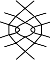

Toc
===
* [Mix snowflakes into new Grounds](#mix-snowflakes-into-new-grounds)
  * [Stitches for six pair snowflakes](#stitches-for-six-pair-snowflakes)
    * [Collapsed stitches](#collapsed-stitches)
    * [Footsides](#footsides)
  * [Recipes for the mixer](#recipes-for-the-mixer)
    * [Modify a given recipe](#modify-a-given-recipe)
    * [Even numbers of stitches](#even-numbers-of-stitches)
  * [Create a recipe from scratch](#create-a-recipe-from-scratch)
    * [Step by step](#step-by-step)
    * [Blob analysis](#blob-analysis)

Mix snowflakes into new Grounds
===============================

On the [snow mixer] you can create diagrams for (new) grounds with a mix of 2x2 snowflakes.

On the left a sample of lace by Babette.
She invented a double hexagonal ring pair around a snowflake.
The intersections of the double ring pairs are in fact compact snowflakes.
This inspired to explore a mix of snowflakes in general.

The pair diagram of a 6-pair snowflake can be interpreted
as a thread diagram of a 3-pair connection.
Each 3-pair connection can be composed with a group of 2-pair stitches.
The mixer starts with the last step as building blocks alias recipes for a combination of 2x2 snowflakes.

[snow mixer]: /GroundForge/mix4snow/

Stitches for six pair snowflakes
--------------------------------

The mixer generates thread diagrams for three pair stitches.
Using these thread diagram as a pair diagram,
allows to assign stitches for six pair snowflakes,
spiders or whatever needing six pairs.

On the right you see the default pattern of the [snow mixer].

* Click the button _pair diagrams from thread diagrams_ on the mixer page,
  and you will see the screenshot below with an empty thread diagrams.
* Click wands to (re)generate diagrams.
* [Play](/GroundForge-help/Icons)
  with the size of the panels and move the content as you see convenient.
* The mouse in the screenshot points to the stitch that is highlighted with green in the stitches panel.
* You can edit the stitches panel manually or use (a variation of) a predefined stitch above _Step 1_.

See also the _show help links_ button of this _pair diagrams from thread diagrams_ page.

For a pretty screenshot or PDF you can resume the animation for a less stretched look.

When you changed the pattern on the snow mixer,
some stitches might have their ID changed, or they are no longer applicable at all.

### Collapsed stitches

We might encounter repeated actions in a stitch.
Repeated twists are the most common in traditional lace.
The sample on the left below shows a repeated cross on both sides.
For GroundForge anything done with the same two pairs is a single stitch.
We see that below when we compare a traditional pair diagram with the  GroundForge pair diagram for step 1.
We can counteract that effect with a _ctctttctc_ as shown on the right. 
You might want this stitch for the vertical connection between two spiders or snowflakes.

| thread diagram on mixer page | traditional pair diagram   | step 1 on  _pair diagrams from thread diagrams_ |
|:-------------------------------:|-------------------------------|:--------------------------------------------------:|
|            |    |     &nbsp;   |

### Footsides

A footside that works for one set of recipes may not work for another.
This is caused by footside twists that may or may not collapse
with ground twists or vice versa.
The default footside is based on a _crc_.
To choose another stitch as basis you need to
follow the link-button _tweak footsides_ in the mixer,
before you go to the _pair diagrams from thread diagrams_ page.

On the right a simplified pattern (blue) without collapsed twists
and a _tct_ as basis (give or take a twist) as shown between the bobbins.
This basis gives you more options.
The two different footsides have each their own consequences for the flow of threads.

The example on the left has a _rclcrclcr_ as basis, again give or take a twist.
A passive (red line)  more or less is not significant to control the thread flow,
but you might want more pairs for more elaborate footsides.
The  _stitches and threads_ page has a link "back" to the _pattern definition_ page.
That page has room for five more pairs in the left footside. See this [advanced] technique.
The _pattern definition_ page has a link to the _stitches and threads_ page.
The links back and forth preserve the pattern from the mixer page as long as you
did not change the number of columns for the left footside.
Both pages give you a chance to adjust the [swatch size] and have links to return.
See the _show help links_ button  pages.

An example with the advanced technique:  
  pattern page <textarea rows="3" cols="6" spellcheck="false">----xx
----xx
----xx
----xx
----4y
----rx
----rx
----r8
----xx
----xx
----xx
----xx
----4y
----rx
----rx
----r8</textarea> stitches page: _clcrclc_ and _lcrcl_

<!-- TODO develop recipes from simplified  -->
[swatch size]: /GroundForge-help/Patch-Size
[simplified]: /GroundForge/droste?patchWidth=1?patchWidth=1&patchHeight=15&footside=4,x&tile=-,5&headside=7,x&shiftColsSW=0&shiftRowsSW=2&shiftColsSE=1&shiftRowsSE=2&c1=lctrr&a1=rctll&b2=ctc&droste2=c10=c11=c12=tctctct,c13=rrtctctct,a10=tctctctc,a11=ctctctc,a13=ctctct,a12=lllctctctctc#
[advanced]: /GroundForge-help/Advanced#footside-tutorial

Recipes for the mixer
---------------------

The [snow mixer] shows a few recipes with thumbnails.
This is just to get you started as a collection with recipes can barely scratch the surface of the possibilities.
In [counting snow families](https://d-bl.github.io/MAE-gf/docs/counting-snow/)
we have 230 families for the type of snowflakes for the mixer.
The counting page explores only two families with [recipes](MAE-gf/docs/counting-snow/#exploring-families),
but not exhaustively.

About half of the _B3_ samples in [Viele gute Gründe](/MAE-gf/docs/literature)
are members of only 2 families and need only 17 recipes.
The other half is member of 25 families with an average of almost 3 samples per family.
This leaves 203 families not explored.

### Modify a given recipe

The following list of steps shows some hover actions.
A mobile device does not support hovering, it requires a little more trial and error without.
Click the blue hexagon again when you guessed wrong with removing the color.

Suppose we want to remove the center of a spider as shown in dark blue in the figures below.

* Click the spider below the form.
* Click the dark blue hexagon.
* Hover over the center of the spider as shown in figure (a).
* Hover over the stitches in the plait until you see the start of the id shown in figure (b).
* Click the stitch to check the color disappears from the desired stitch in the thread diagram.
* In this case we clicked the fourth stitch of the plait.
* Figure (a) adds a two to the id in figure b, as the application starts with zero that means the third action.
* The recipe was _lc,crc,ctc,lcrcl,ctc,crc,c,r_, the fourth stitch is _lcrcl_ as we saw on the tooltip.
  We have to remove the third action which is the _r_.
  Note that a _t_ counts as two actions: twist left plus twist right.

|    figure (a)    |    figure (b)    |      figure (c)       |
|:----------------:|:----------------:|:---------------------:|
|  |  |  |

### Even numbers of stitches

Note figure (c) above: the last "stitch" of the plait is white, the "stitch" is just a right twist.
To get an even number of stitches, we had to separate it from the preceding stitch which now is just a cross.
For technical reasons the mixer template does not support odd numbers of stitches.

In other occasions we can't split but have to add a stitch of just twists to get an even number.
Such as for the triangle recipe.
This causes crossed legs in the pair diagram generated from the thread diagram.
We can counteract that effect with "stitch" that just twists the legs.
Below snippets of this
[pattern](https://d-bl.github.io/GroundForge/droste?source=mix4snow&source=mix4snow&source=mix4snow&tile=48y-,xrx-,xrx-,xr83,y-48,x-xr,x-xr,83xr,48y-,xrx-,xrx-,xr83,y-48,x-xr,x-xr,83xr&f8=llttcrr&f16=llttcrr&footside=-----x,-----x,-----x,-----x,-----4,-----r,-----r,-----r,-----x,-----x,-----x,-----x,-----4,-----r,-----r,-----r&=undefined&u8=rrttcll&u16=rrttcll&headside=x,x,x,8,r,r,r,r,x,x,x,8,r,r,r,r&shiftColsSW=0&shiftRowsSW=16&shiftColsSE=4&shiftRowsSE=8&patchWidth=14&patchHeight=35&i1=rc&h1=t&g1=ctcl&h2=crclcr&n5=llctt&i5=ctcl&g5=ct&j9=lc&h9=t&j13=t&g13=lc&g16=tctc&h16=rctc&h4=t&h8=rctc&g8=tctc&g9=ctcl&g12=lc&i12=tctc&j12=rctc&i13=ctcl&j16=t&j4=rctc&i4=tctc&j5=t&i8=rc&j8=t&i16=rc&h12=t&droste2=j80=h121=g14=j161=j160=i134=h40=h41=i54=j81=g94=h120=tt,f80=p81=f160=p161=ctcttttttttttlllllctc,f82=f162=rrtctctrr,f83=f163=rrttctc,u82=u162=ctc,u81=u161=tttttttctctttttt,u83=u163=tttttctc,u80=u160=tttctc#).

The mixer can handle up to 10 stitches. That is an arbitrary but hard coded limit.

[workaround]: https://github.com/d-bl/GroundForge/blob/master/docs/_includes/mix4snow/README.md#odd-number-of-stitches

## Create a recipe from scratch

So far we have two approaches to create a recipe from scratch:
The blob analysis and the step-by-step approach.
The pros and cons of these approaches are not yet clear.
It might be a personal preference and also depend on your type of brains.

From scratch is a bit of a misnomer as we start with an existing pair diagram.
That diagram may be found in literature, on the web or created by bending pairs
of a snowflake [family](https://d-bl.github.io/MAE-gf/docs/counting-snow/6-pair-permutations.svg)
as explained on [exploring families](/MAE-gf/docs/counting-snow/#exploring-families).

### Step-by step

The double ring pair of the default pattern is a nice environment to explore or troubleshoot a new recipe.
The following table explains by example.

| recipe                                  | result                  |                                                          |
|:----------------------------------------|:------------------------|:---------------------------------------------------------|
| Right "r,t,t,l"   or: Left "l,t,t,r" |  | Start simple with three pairs twisted twice              |
| crc,t,l,l (Right)                       |           | Start to feed the first thread on the right to the left. |
| crc,crc,l,l                             |           | Go all the way                                           |
| crc,crclc,r,r                           |           | Feed the originally first pair on the left to the right. |
| crc,crclcr,cr,r                         |           | Go all the way                                           |
|                                         |                         | Etcetera                                                 |

### Blob analysis

To start from scratch, we need to interpret a six-pair diagram as a thread diagram.
On the left an arbitrary example.

The stitches composing the three pair stitch are marked with blobs.
The blobs are numbered in working order.
The caption enumerates the stitches in working order, one per blob.
The R prefix means we start on the right.

It helps to trace the pair diagram with the proper alternating over-under effects of the threads.
Another color for each thread helps to recognize when to start a new stitch:
A stitch worked with the middle and right pair can't use the left pair and vice versa.

The (too complicated) interpretation of the same example on the right illustrates requirements for the blobs:
* Span 4 threads.
* The threads flow two by two into adjacent blobs. For example red and orange flow from two to three and blue and purple from two to four.
  This can be deceptive: five may seem to receive black from one while it actually goes via three.
* Not all threads in a blob need to have an interaction with other threads.
  For example: the black and blue pairs in the third blob do nothing, like the green pair in the fifth.
