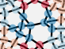

Toc
===
* [Mix snowflakes into new Grounds](#mix-snowflakes-into-new-grounds)
  * [Recipes for the mixer](#recipes-for-the-mixer)
    * [Modify a given recipe](#modify-a-given-recipe)
    * [Even numbers of stitches](#even-numbers-of-stitches)
    * [Blob analysis](#blob-analysis)
    * [Try step by step](#try-step-by-step)
  * [Stitches for six pair snowflakes](#stitches-for-six-pair-snowflakes)
  * [Save and recall a pattern](#save-and-recall-a-pattern)

Mix snowflakes into new Grounds
===============================

On the [snow mixer] you can create diagrams for (new) grounds with a mix of snowflakes.

On the left a sample of lace by Babette.
She invented a double hexagonal ring pair around a snowflake.
The intersections of the double ring pairs are in fact compact snowflakes.
This inspired to explore a mix of snowflakes in general.

The pair diagram of a six pair snowflake can be interpreted
as a thread diagram of a three pair connection.
Each three pair connection can be composed with a group of two pair stitches.
The mixer starts with the last step as building blocks alias recipes for a combination of four snowflakes.

[snow mixer]: /GroundForge/mix4snow/

Recipes for the mixer
---------------------

The mixer shows a few recipes for its building blocks with thumbnails.
This is just a start as a collection with recipes can barely scratch the surface of the possibilities.
The dazzling numbers are explained on [counting snow families](https://d-bl.github.io/MAE-gf/docs/counting-snow/)
We have a few more [recipes](/MAE-gf/docs/snow-stitches/563412-145236.svg) of only two families.

### Modify a given recipe

The full list of steps if for a laptop or desktop.
A mobile device does not show the tooltips. It requires more trial and error without the hover steps.
Click the blue hexagon again when you guessed wrong with removing the color.

Suppose we want to remove the center of a spider. 

* Click the spider below the form.
* Click the dark blue hexagon.
* Hover over the center of the spider as shown in figure (a).
* Hover over the stitches in the plait until you see the start of the id shown in figure (b).
* Click the stitch to check the color disappears from the desired stitch in the thread diagram.
* In this case we clicked the fourth stitch of the plait.
* Figure (a) adds a two to the id in figure b, as the application starts with zero that means the third action.
* The recipe was `lc,crc,ctc,lcrcl,ctc,crc,c,r`, the fourth stitch is `lcrcl` as we saw on the tooltip.
  We have to remove third action which is the `r`.
  Note that a `t` counts as two actions: twist left plus twist right.

|    figure (a)    |    figure (b)    |      figure (c)       |
|:----------------:|:----------------:|:---------------------:|
|  |  |  |

### Even numbers of stitches

Note figure (c) above: the last "stitch" of the plait is white, the "stitch" is just a right twist.
To get an even number of stitches, we had to separate it from the preceding stitch which now is just a cross. 
For technical reasons the mixer template does not support odd numbers of stitches, see this [workaround].
The mixer can handle up to 10 stitches. That is an arbitrary but hard coded limit.

[workaround]: https://github.com/d-bl/GroundForge/blob/master/docs/_includes/snow/README.md#odd-number-of-stitches

### Blob analysis

To start from scratch, we need to interpret a six-pair diagram as a thread diagram.
On the left an arbitrary example.

The stitches composing the three pair stitch are marked with blobs.
The blobs are numbered in working order.
The caption enumerates the stitches in working order, one per blob.
The R prefix means we start on the right.

It helps to trace the pair diagram with the proper alternating over-under effects of the threads.
Another color for each thread helps to recognize when to start a new stitch:
A stitch worked with the middle and right pair can't use the left pair and vice versa.

The too complicated example on the right illustrates requirements for the blobs:
* Span 4 threads.
* The threads flow two by two into adjacent blobs. For example red and orange flow from two to three and blue and purple from two to four.
  This can be deceptive: five may seem to receive black from one while it actually goes via three.
* Not all threads in a blob need to have an interaction with other threads.
  For example: the black and blue pairs in the third blob do nothing, like the green pair in the fifth.

### Try step by step

The double ring pair of the default pattern is a nice environment to explore or troubleshoot a new recipe.

| recipe                                  | result                  |                                                          |
|:----------------------------------------|:------------------------|:---------------------------------------------------------|
| Right "r,t,t,l"   or: Left "l,t,t,r" |  | Start simple with three pairs twisted twice              |
| crc,t,l,l (Right)                       |           | Start to feed the first thread on the right to the left. |
| crc,crc,l,l                             |           | Go all the way                                           |
| crc,crclc,r,r                           |           | Feed the originally first pair on the left to the right. |
| crc,crclcr,cr,r                         |           | Go all the way                                           |
|                                         |                         | Etcetera                                                 |

Stitches for six pair snowflakes
--------------------------------

The mixer generates thread diagrams for three pair stitches.
Using these thread diagram as a pair diagram,
allows to assign stitches for six pair snowflakes,
spiders or whatever needing six pairs.

On the right you see the default pattern of the [snow mixer].

* Click the button _pairs from threads_ on the mixer page,
  and you will see the screenshot below with empty diagrams.
* Click the wands to generate the diagrams.
* [Play](/GroundForge-help/Icons)
  with the size of the panels and move the content as you see convenient.
* The mouse in the screenshot points to the stitch that is highlighted with green in the stitches panel.
* When you change the content of the stitches panel and go to this page,
  the diagrams are cleared to avoid confusion about inconsistencies.

When you changed the pattern on the snow mixer,
some stitches might have their ID changed, or they are no longer applicable at all.

The twist marks in the pair diagram are not reliable.

Save and recall a pattern
-------------------------

The print function of your browser can save the diagrams [as PDF](/GroundForge-help/clips/print-as-pdf).
Make sure the stitches panel is big enough to accommodate all stitches.
The document has a link back to the interactive page.
In turn the interactive page has a link to the _pair diagram_.
That link should go back to the mixer page with the pattern.
Open the document in your browser, and you can copy the content of the stitches panel
in case the link in the document does not restore it properly. 