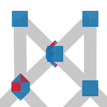
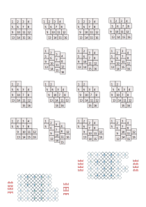

Edit symmetries
===============

The [editor](GroundForge/symmetry) is inspired by Veronika Irvine's course on [DFZ] in 2021.
The course teaches a pencil and tracing paper method to combine copies of tiles into arrangements with a variety of symmetries.

[DFZ]: https://doily-free-zone.namastream.com/product/26887/about

Download / Browse
-----------------
Other GroundForge pages use address bar components to define a pattern.
With the symmetry editor you start with init, can save your work
with a download and browse your saved files to reload.
When editing a downloaded diagram with some SVG editor,
it can still be reloaded, but editing might no longer work.

Init: meaning of form values
----------------------------
The bottom line in the following image shows how the tile dimensions are counted.
Note that large dimensions can make the page slow.

Variant 1 and 2 below, note that the template frame of the DFZ course is not rendered.

Mouse actions in the diagram
----------------------------

### Click

A click on a pair sets the number of twists between both stitches
as specified in the form above the diagrams.

The same form specifies what happens when you click a stitch:
Delete or apply the color-code for another stitch.

Note that the color codes reflected with the rest of the tiles,
but the tool-tips are not.
Stitches along the edges are projected on top of one another.
Experiment for the desired effect in the desired pattern
or adjust the download with a third party tool.

### Drag

#### Stitches

Moving stitches is pretty trivial.
Stitches along the edges can not be moved.
The algorithm does not enforce any limits on moving stitches,
so it is your own responsibility to avoid crossing lines.

#### Center of pairs

Moving the center of a pair is a kind of pinching action to create a new stitch.
On mouse down you will see two highlighted pairs kissing the selected pair,
interrupted by some segments that should not make a connection
because they touch the selected segment.

Without these highlights you might be tempted
to make a connection with one of the grey lines at the bottom of the big hole.
That would create an impossible loop in a pair.
When you release the mouse after dragging, the algorithm creates a new stitch
with the green segment whose center is closest to the mouse position.
In the example, the connection could easily be made with the wrong highlighted pair.
Make sure to move close enough to the desired pair.

Indents
-------

_Work in progres_

Currently, only the third column of the first two rows below are implemented.
The number of rows are not exhaustive but many configurations may cause duplicates.

At the bottom is illustrated how two of the nine spreadsheet layouts are shifted versions.
They are omitted because too many layouts reduce the performance.

