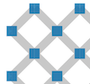
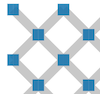
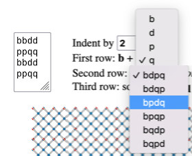
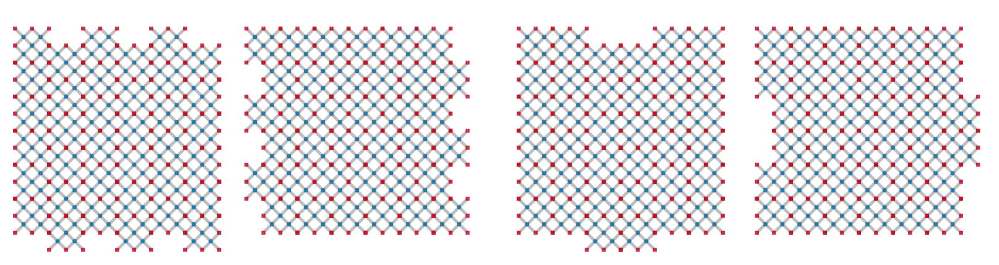
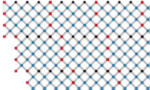
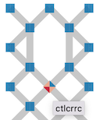
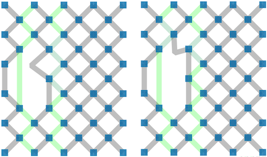
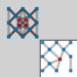
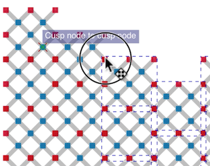

- [Edit symmetries](#edit-symmetries)
- [The forms](#the-forms)
  * [Download / Browse](#download---browse)
  * [Template dimensions](#template-dimensions)
  * [Template variants](#template-variants)
  * [Define click/tap actions](#define-click-tap-actions)
  * [Swatches of templates](#swatches-of-templates)
- [Edit a template with mouse actions](#edit-a-template-with-mouse-actions)
  * [Constraints](#constraints)
  * [Click/Tap](#click-tap)
  * [Drag Stitches](#drag-stitches)
  * [Add stitches](#add-stitches)
- [Third party editors](#third-party-editors)
  * [File structure](#file-structure)
  * [Unlink clones](#unlink-clones)
  * [Other changes](#other-changes)

Edit symmetries
===============

_Create a single template and browse through dozens of pattern variations created with the template._

The [page](/GroundForge/symmetry) has a few forms before an editable template
and (optionally) several swatches in a smaller scale.
The swatches are various configurations of reflected and rotated repeats of the template.
One of the forms lets you quickly browse through more swatches.
You can drop, move and add stitches in the template and apply a [color code] to the stitches:
the 4 colors per stitch approach.
The color code is properly reflected and rotated in the swatches.

The editor is inspired by Veronika Irvine's course on [DFZ] in 2021
or rather the [bonus lesson] with Inkscape. 
The page simplifies tedious tasks and enforces some constraints.
Currently, it is not possible to generate thread diagrams from the diagrams.

[DFZ]: https://doily-free-zone.namastream.com/product/26887/about
[color code]: color-rules
[bonus lesson]: https://youtu.be/0mf_pE2Ywk8

The forms
=========
An overview of the fields and controls on the forms.

Download / Browse
-----------------
Other GroundForge pages use address bar components to define a pattern.
With the symmetry editor you start with a new template, can save your work
with a download and browse your saved files to reload.

Template dimensions
-------------------
The bottom line in the following image shows how the tile dimensions are expressed with number of stitches.
Note that large dimensions can make the page slow and viewing all the patterns will 
require scrolling or zooming out (ctrl-minus on Windows, cmd-minus on Mac) by your browser.

You can get unexpected results when dimension values do not match the actual template.
After changing width and or height you must create a new template or reset the values.

Template variants
-----------------
Note the corners in variant 1 and 2 below.
For those who followed the DFZ course: the frame of the template is not rendered.

 &nbsp; &nbsp;

Define click/tap actions
------------------------
Some form fields influence the effect of click/tap actions:

* the number of twist marks on a line connecting two stitches
* delete a stitch or set its [color code]
* the stitch definition that defines the color code

Swatches of templates
---------------------
The swatches are constructed by reflections, rotations and glides of template copies.
The letters `bdpq` are used to illustrate the transformation per copied template.
The swatches have the four letters arranged in diagonals, columns, 
rows and squares as shown by bars in the following figure.

Marks at the start of these bars indicate the indent pattern, either one by one or two by two.
One input field controls the amount of indent for all swatches at once.
Some swatches repeat themselves faster than others. 
The maximum value of the input field allows all swatches to browse through all options.

Two dropdown fields define variations of the swatches represented with straight bars.
Each bar repeats a single letter.

A text field defines the last row of patterns.
The z-shaped bars contain the sequence as taken from
the drop-down for the second row of patterns.
You can define your own configuration manually.
The field should contain a 4x4 sequence even if that means repeating yourself.
This last row of swatches is omitted on invalid input.

When full repeats of the template are indented,
templates are added up front and dropped from the back
as shown in the following figure.

Hover with your mouse over the grey dot next to a swatch for a tooltip that shows the specifications.
This can be of help after reloading a file.
In Inscape, you need the [XML-editor](xml-title.png) to retrieve the information.
Other SVG editors might or might not preserve this information.

Note that a larger scale for the swatches gives more room for the legend of applied stitches.

Edit a template with mouse actions
==================================

Constraints
-----------
Some constraints are enforced:

* Stitches along the perimeters can not move or be deleted
* New stitches can only be made between two neighbouring kissing pairs.
* Stitches along opposite borders are identical.

You have to observe the following constraints by yourself:

* Keep the position of stitches within the perimeter of the template.
* Only create stitches with the bright sections of kissing pairs
* Don't separate the template in two disconnected sections,
  though some swatches may produce valid results.
* Stitches along the perimeter should be symmetrical
  when reflected in a vertical or horizontal mirror.
* Stitches should be identical for all borders
  for the template variant with stitches in the corners.

The following diagram illustrates one of the reasons  for the requirements along the edges of the template.
The stitches are projected on top of one another and the line with black stitches is interrupted with red ones.

  
Click/Tap
---------

Deleting stitches may cause segments on top of one another, they appear darker.
When reconnecting, move a bright segment to the darker ones for predictable behavior.

The legend not only enumerates stitches in the template, but also reflected and rotated versions.
Note that the tooltips in the swatches show the original `ct` sequence, not the reflected or rotated versions.

Drag Stitches
-------------
Moving stitches is pretty trivial.
Stitches along the edges can not be moved.
The algorithm does not enforce any limits on moving stitches,
so it is your own responsibility to avoid crossing lines or 
move stitches at or beyond the border of the template.

Add stitches
------------
Moving the center of a line between two stitches initiates a kind of pinching action to create a new stitch.

To fix mistakes, it is good to have _click mode for stitches_ set to _delete_
before you start dragging.
To undo, simply click at the same spot where you released the mouse button.

On mouse down you will see two highlighted pairs kissing the selected pair.
Move the mouse to the center of one of the bright segments to make a new stitch
and release the mouse button.

At the moment the algorithm happily makes connections with the darker sections of the kissing pairs.
That would cause crossing lines.

Third party editors
===================

After download, you can customize and annotate the generated patterns with a 
[third party editor](Reshape-Patterns#evaluated-editors).
The generated file has properties to observe when customizing and reloading for further changes with the web page.

File structure
--------------

The code snippet below is a trimmed down version of a generated file to illustrate its structure.
The SVG document is loaded into an HTML element `
`.
The template diagram as discussed above lives actually in the group with id `#cloned`.
This identifier reflects how the group is used to create the swatches in the group with id `#clones`.

    <defs>
      <marker id="twist-1"/>
      <marker id="twist-2"/>
      <marker id="twist-3"/>
    </defs>
    <g id="clones">
      <g id="clb"><use xlink:href="#cloned"/></g>
      <g id="cld"><use xlink:href="#cloned"/></g>
      <g id="clp"><use xlink:href="#cloned"/></g>
      <g id="clq"><use xlink:href="#cloned"/></g>
      <g>
        <g><title/><circle/></g>
        <use xlink:href="#clb"/>
        <use xlink:href="#cld"/>
        <use xlink:href="#clp"/>
        <use xlink:href="#clq"/>
      </g>
    </g>
    <g id="bdpqLegend"/>
    <g id="cloned">
      <path class="link kiss_2 starts_at_123 ends_at_456"/>
      <g id="123" class="node"><title>ctc<title>...</g>
    </g>

A change to a field in the form section _swatches of templates_ replaces the full content of `#clones`.
A change to a stich in the template replaces the full content of `#bdpqLegend`
and one of the elements with class `node`.
Due to their nature the appearance of the `<use>` elements change along with template in group `#cloned`.

The algorithm to delete and add stitches relies on the classes 
in the elements of `#cloned` and the ids of the `node` elements.
The classes `node`, `link` and `kiss_` allow selecting and manipulating groups of objects.
The classes `starts_at_` and `ends_at_`  allow moving segments along with the stitches.
They should also allow to build a chain of links within a kissing pair.

**Note** after unlinking clones, the classes `starts_at_`, `ends_at_` and `kiss_`
lose their functional meaning, like the title in the `node` groups.

Unlink clones
-------------

Inkscape may react slow unlike other applications that import clones as plain copies.
To improve the performance in InkScape, you might want to remove the patterns you are not interested in.

A drastic way to unlink is removing the originals: the template in the top left corner
of the sheet and four b-d-p-q clones stacked on top of one anther beyond that corner of the sheet.
That action might take a wile, and you loose the power of changing all copies at once.

Other changes
-------------

To increase swatch sizes, repeat the last 4 rows and/or columns of template copies.
Snapping is a great tool to align the groups of objects:

