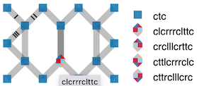

- [Edit symmetries](#edit-symmetries)
- [The forms](#the-forms)
    * [Download / Browse](#download---browse)
    * [Template dimensions](#template-dimensions)
    * [Template variants](#template-variants)
    * [Define click/tap actions](#define-click-tap-actions)
    * [Swatches of templates](#swatches-of-templates)
- [Edit a template with mouse actions](#edit-a-template-with-mouse-actions)
    * [Click/Tap](#click-tap)
    * [Drag Stitches](#drag-stitches)
    * [Add stitches](#add-stitches)
- [Third party editors](#third-party-editors)

Edit symmetries
===============

_Browse through dozens of pattern variations created from a single template._

The [page](GroundForge/symmetry) starts with some forms but revolves about a template that is repeated in several swatches in a smaller scale.
These swatches are various configurations of reflected and rotated repeats of the template.
You can quickly browse through more variations created from the same template
with a few controls in a form.

In the template you can drop and add stitches and apply a [color code] to the stitches.
The color code is also reflected and rotated in the swatches.

The editor is inspired by Veronika Irvine's course on [DFZ] in 2021
or rather the [bonus lesson] with Inkscape. This page reduces some tedious tasks. 

Currently, it is not possible to generate thread diagrams from the generated diagrams.

[DFZ]: https://doily-free-zone.namastream.com/product/26887/about
[color code]: color-rules
[bonus lesson]: https://youtu.be/0mf_pE2Ywk8

The forms
=========
An overview of the fields and controls on the forms.

Download / Browse
-----------------
Other GroundForge pages use address bar components to define a pattern.
With the symmetry editor you start with a new template, can save your work
with a download and browse your saved files to reload.

Template dimensions
-------------------
The bottom line in the following image shows how the tile dimensions are expressed with number of stitches.
Note that large dimensions can make the page slow and viewing all the patterns will 
require scrolling or zooming out (ctrl-minus on Windows, cmd-minus on Mac) by your browser.

You can get unexpected results when dimension values do not match the actual template.
After changing width and or height you must create a new template or reset the values.

Template variants
-----------------
Note the corners in variant 1 and 2 below.
For those who followed the DFZ course: the frame of the template is not rendered.

 &nbsp; &nbsp;

Define click/tap actions
------------------------
Some form fields influence the effect of click/tap actions:

* the number of twist marks on a line connecting two stitches
* delete a stitch or set its [color code]
* the stitch definition that defines the color code

Swatches of templates
---------------------
The swatches are constructed by reflections, rotations and glides of template copies.
The letters `bdpq` are used to illustrate the transformation per copied template.
The swatches have the four letters arranged in diagonals, columns, 
rows and squares as shown by bars in the following figure.
Marks at the start of these bars indicate the indent pattern, either one by one or two by two.

Two dropdown fields define variations of the swatches represented with straight bars.
Each bar repeats a single letter.

A text field defines the last row of patterns.
The z-shaped bars contain the sequence as taken from
the drop-down for the second row of patterns.
You can define your own configuration manually.
The field should contain a 4x4 sequence even if that means repeating yourself.
This last row of swatches is omitted on invalid input.

When full repeats of the template are indented,
templates are added up front and dropped from the back
as shown in the following figure.

Edit a template with mouse actions
==================================

Click/Tap
---------
A form specifies how many twist are set when you click a pair
and whether a clicked stitch is deleted or gets its color code changed.
Segments on top of one another appear darker.

 &nbsp; &nbsp;

Note that the color codes are reflected with the rest of the template copies,
but the tool-tips are not. The legend though does enumerate all stitches correctly.

Stitches along the edges of the template are projected on top of one another
when repeated in mirrored and rotated copies.
For this reason those stitches change all at once. 
There are two groups: illustrated with black and red below.

Drag Stitches
-------------
Moving stitches is pretty trivial.
Stitches along the edges can not be moved.
The algorithm does not enforce any limits on moving stitches,
so it is your own responsibility to avoid crossing lines or 
move stitches at or beyond the border of the template.

Add stitches
------------
Moving the center of a line between two stitches is a kind of pinching action to create a new stitch.
On mouse down you will see two highlighted pairs kissing the selected pair,
interrupted by some segments that should not make a connection
because they touch the selected segment. 

It would have been better to highlight even less segments.
However, so far this was a simple to implement precaution that prevents you
to connect with one of the grey lines at the bottom of the big hole.
That would create an impossible loop in a pair.

When you release the mouse after dragging, the algorithm creates a new stitch
with the green segment whose center is closest to the mouse position.
Make sure to move close enough to the desired segment.
Otherwise, a connection could be made with a segment that would cause crossing lines.

Third party editors
===================

After download, you can customize, scale and annotate the generated patterns with a 
[third party editor](Reshape-Patterns#evaluated-editors).

Inkscape may react slow unlike other applications that import clones as plain copies.
To improve the performance in InkScape, you might want to remove the patterns you are not interested in,
or unlink the clones. 
A drastic way to unlink is removing the originals: the template in the top left corner
of the sheet and four b-d-p-q clones stacked on top of one anther beyond that corner of the sheet.
That action might take a wile, and you loose the power of changing all copies at once.

Some groups of objects are important to observe when you want to reload the file for further changes by the web application:
the template group with id `#cloned`, the swatches group with id `#clones` and `#bdpqLegend`. 
The latter two groups get replaced when changing indents and/or `bdpq` configurations,
manual changes to these groups will get lost unless moved out of these groups.
The legend also changes when stitches are changed. 

The `#cloned` group is more vulnerable. It is safe to add objects to this group.
Further constraints on why/what to (not) change on objects in this group are way beyond the scope of this document.

Make use of snapping to align (groups of) objects:

