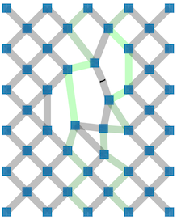

Edit symmetries
===============

_Browse through dozens of pattern variations created from a single template._

The [page](GroundForge/symmetry) starts with some forms but revolves about a template that is repeated in several swatches in a smaller scale.
These swatches are various configurations of reflected and rotated repeats of the template.
You can quickly browse through dozens of more variations created from a single template
with a few controls in a form.

In the template you can drop and add stitches and apply a [color code] to the stitches.
The color code is also reflected and rotated in the swatches.

The editor is inspired by Veronika Irvine's course on [DFZ] in 2021
or rather the bonus lesson with Inkscape. This page reduces the labor even more. 

Currently, it is not possible to generate thread diagrams from the generated diagrams.

[DFZ]: https://doily-free-zone.namastream.com/product/26887/about
[color code]: color-rules

The forms
=========
Explanation of the fields and controls on the forms.

Download / Browse
-----------------
Other GroundForge pages use address bar components to define a pattern.
With the symmetry editor you start with a new template, can save your work
with a download and browse your saved files to reload.

Though you are reusing a previous template, you might have to manually adjust
the width and height for a new template.
These values are used to apply changes to the reloaded patterns.

New template
------------
The bottom line in the following image shows how the tile dimensions are expressed with number of stitches.
Note that large dimensions can make the page slow and viewing all the patterns will 
require scrolling or zooming out (ctrl-minus on Windows, cmd-minus on Mac) by your browser.

Note the corners in variant 1 and 2 below.
For those who followed the DFZ course: the frame of the template is not rendered.

Define click/tap actions
------------------------
Some form fields influence the click/tap actions:

* the number of twist marks on a line connecting two stitches
* delete a stitch or set its [color code]
* the stitch definition that leads to the color code

Patterns, constructed with the template
---------------------------------------
Patterns are constructed by reflections, rotations and glides of the template.
The letters `bdpq` are used to illustrate these transformations.
The predefined patterns have the four letter arranged in diagonals, columns, rows and squares.

    bd bd bb    bdpq bbbb bdpq bbbb    dbdb bpbp bpbp ....
    db bd dd    bdpq dddd bdpq dddd    qpqp qpqp dqdq ....
                bdpq pppp bdpq pppp    bdbd dbdb bpbp ....
                bdpq qqqq bdpq qqqq    pqpq qpqp dqdq ....

The second through seventh patterns can be varied with two dropdown fields. 
A text field is available to define a custom pattern as the last of all pattern variations.
The field should contain a 4x4 sequence of `d`, `p`, `p` and/or `q` defining a custom pattern.
This last pattern is omitted on invalid input.

Two patterns are repeated, one pair applies the optional indent row by row,
the second set indents the rows two by two, like shown below.

    1      123456            11      123456                         
    21      123456           2211    123456                         
    321      123456          332211   123456                         
    4321      123456         443322   123456                         
     4321      123456          4433    123456                         
      4321      123456           44    123456                         
       432                                                
        43                                                 
         4                                                  

However, when full repeats of the template are indented,
templates are added up front and dropped from the back.

Edit a template with mouse actions
==================================

### Click/Tap

A form specifies how many twist are set when you click a pair
and whether a clicked stitch is deleted or gets its color code changed.

 &nbsp; &nbsp;

Note that the color codes are reflected with the rest of the tiles,
but the tool-tips are not.

Stitches along the edges of the template are projected on top of one another
when repeated in mirrored and rotated copies.
It is not possible to delete these stitches.
Stitches along the top and bottom are kept identical, black in the illustration below.
This also happens with the stitches along the sides, red in the illustration below.

### Drag Stitches

Moving stitches is pretty trivial.
Stitches along the edges can not be moved.
The algorithm does not enforce any limits on moving stitches,
so it is your own responsibility to avoid crossing lines or 
move stitches at or beyond the border of the template.

Add stitches
------------
#### Center of pairs

Moving the center of a pair is a kind of pinching action to create a new stitch.
On mouse down you will see two highlighted pairs kissing the selected pair,
interrupted by some segments that should not make a connection
because they touch the selected segment. 

It would have been better to highlight even less segments.
However, so far this was a simple to implement precaution that prevents you
to connect with one of the grey lines at the bottom of the big hole.
That would create an impossible loop in a pair.

When you release the mouse after dragging, the algorithm creates a new stitch
with the green segment whose center is closest to the mouse position.
Make sure to move close enough to the desired segment.
Otherwise, a connection could be made with a segment that would cause crossing lines.

Third party editors
===================

After download, you can customize the generated patterns with a third party editor.
For example indent the patterns that don't react to the indent form field.
To improve the performance of InkScape you might want to remove the patterns you are not interested in.
For other applications (those wh reduce clone to plain copies) that might not matter.

Note that these customisations get lost after reloading and making other adjustments.
It is also possible that other customisation break functionality.